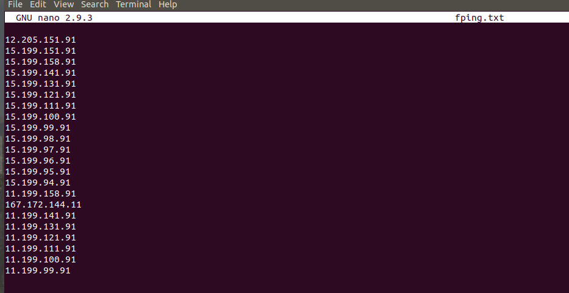
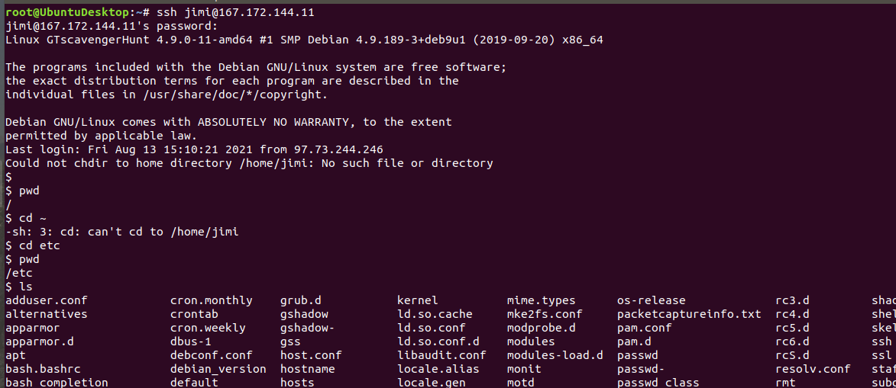
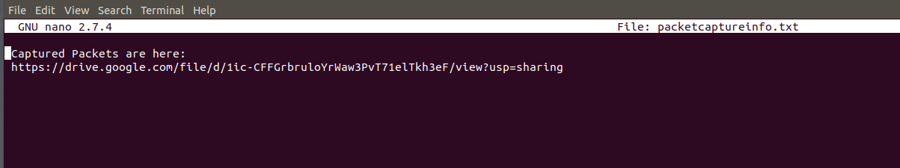
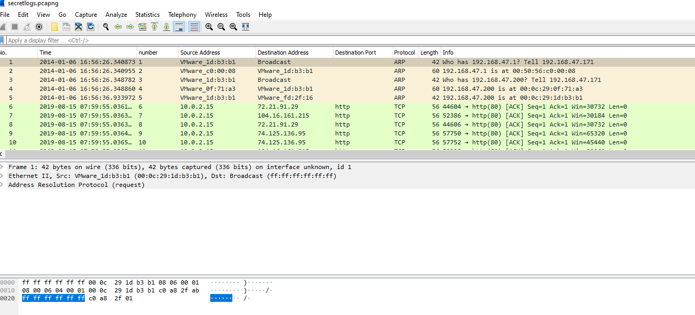
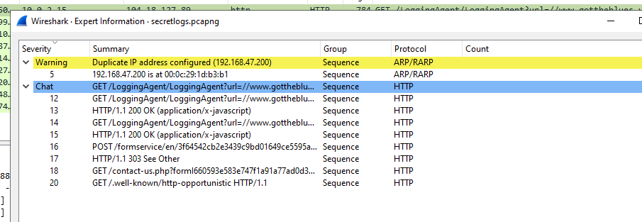
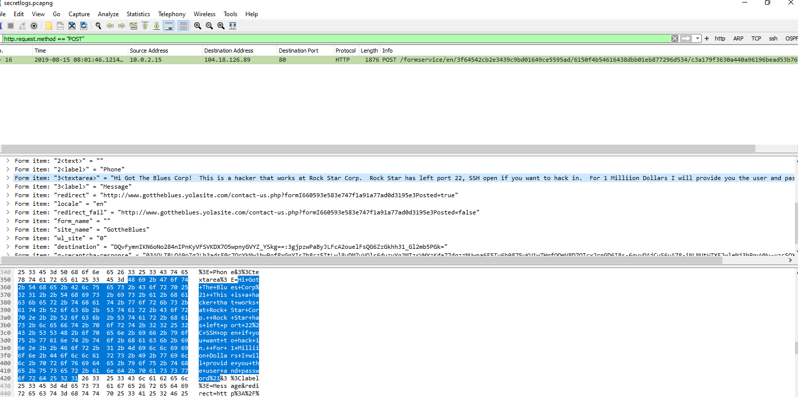

# Rob Myers Week 8 Homework
## Networking Fundamentals Homework: Rocking your Network!

# Phase 1: "I'd like to Teach the World to Ping"

INSTRUCTIONS: 

        * You have been provided a list of network assets belonging to RockStar Corp. Use fping to ping the network assets for only the Hollywood office.

        * Determine the IPs for the Hollywood office and run fping against the IP ranges in order to determine which IP is accepting connections.

        * RockStar Corp doesn't want any of their servers, even if they are up, indicating that they are accepting connections.

        * Create a summary file in a word document that lists out the fping command used, as well as a summary of the results.

        * Your summary should determine which IPs are accepting connections and which are not.

        * Also indicate at which OSI layer your findings are found.

SOLUTIONS: 

   ## Created fping.txt in nano containing all the IP Addresses

  

## From command line ran: fping < fping.txt to show what IP Address is "Alive" and what IP address is "unreachale"

   ## Last, the OSI layer  corresponding with the IP Address is the Network Layer

# Phase 2:  "Some Syn for Nothin`"

INSTRUCTIONS:

    * For the purpose of this exercise, document which ports are open on the RockStar Corp server, and which OSI layer SYN scans run on.

## Example of running the nmap command/ PORT 22 is open

## Also the OSI layer SYN scans run on is Transport Layer (Layer 4)

# Phase 3: "I Feel a DNS Change Comin' On"
INSTRUCTIONS:

    * Try to figure out which port/service would be used for remote system administration, and then using these credentials, attempt to log into the IP that responded to pings from Phase 1.
  

## Logged in as Jimi Hendrix using IP 167.172.144.11

    * While logged into the RockStar server from the previous step, determine if something was modified on this system that might affect viewing rollingstone.com within the browser. When you successfully find the configuration file, record the entry that is set to rollingstone.com.
    
## Used Nanohosts to find 98.137.246.8 rollingstone.com

    * Terminate your ssh session to the rollingstone server, and use nslookup to determine the real domain of the IP address you found from the previous step.

## Used nslookup 98.137.246.8 to find the right domain

 
## HTTP and DNS is layer 7 of the OSI model or the Application Layer

# Phase 4:  "ShARP Dressed Man"

    * View the file to find where to recover the packet captures.

## Picture documenting I am logged in as Jimi, in the ETC Directory and a picture of the file packetcaptureinfo.txt

   

## Picture of the information inside jimi's file packetcaptureinfo.txt

   

    * Use Wireshark to analyze this pcap file and determine if there was any suspicious activity that could be attributed to a hacker. 

## Picture of jimi packet being downloaded to wireshark

## Screen shot of all the suspicious activity 
   ###     - Duplicate IPAdress
   ###     - GET/POST commands
 
 

    * Per the homework assignemnt, the hacker left a note as to where he stored away some packet captures. 

## Screen shot of Jimi's NOTE attempting to sell a user name and password for ONE MILLION DOLLARS inorder to access port 22

 

## ARP is layer 3 of the OSI model or the Network Layer
## HTTP is layer 7 of the OSI model or the Application Layer

# Guidelines for your Submission:

List the steps and commands used to complete the tasks.
 - used NANO to creat a TXT Document containing all of the IP Address's
 - ran the fping command
 - ran sudo -s to switch to root user
 - ran ssh jimi@167.177.144.11 
 - ran nslookup
 - ran NANO to open up packetcaptureinfo.txt

List any vulnerabilities discovered.
 - discovered that port 22 is open
 
List any findings associated to a hacker.
- discovered that the haker is using two IP Address's
- GET/POST commands being run
- hacker works for Rock Star Corp
- hacker is attempting to sell a user name and password for ONE MILLION    Dollars to access and hack into system 

Document the mitigation recommendations to protect against the discovered vulnerabilities.
- take appropriate actions to secure port 22
- monitor activity to apprehend employee "Jimi Hendrix" aswell as any potential "customer" who might get the user name and password from "Jimi Hendrix"

Document the OSI layer where the findings were found.

- the findings from wireshark were found using the HTTP Protocol which is associated with layer 7 of the OSI Model: Application Layer
-however other layers of the OSI Model used throughout this homework lesson include the following: 

    - Network Layer (Layer 3) 
    - Transport Layer (layer 4)
    - Applicatin Layer (layer 7) 

