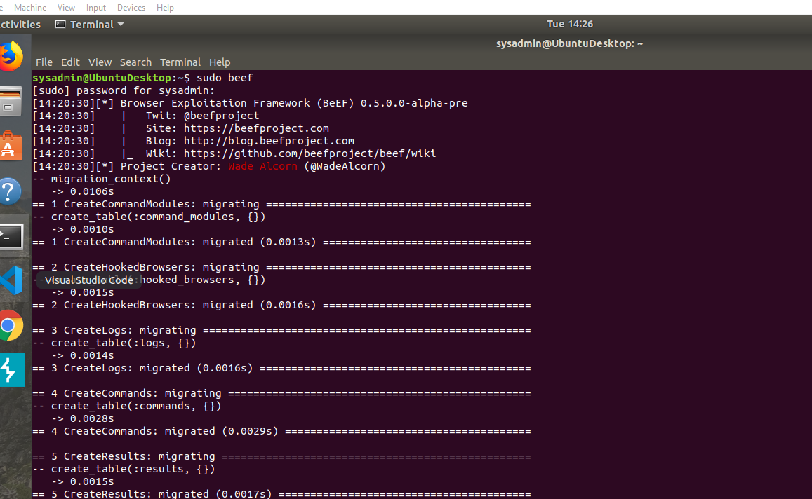
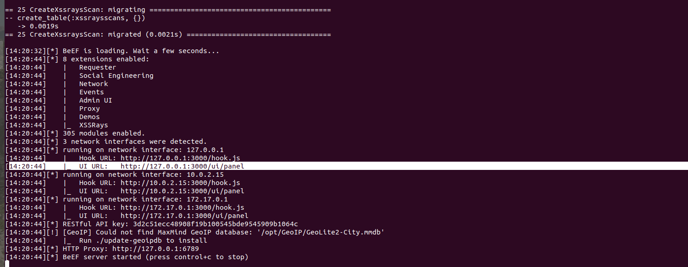
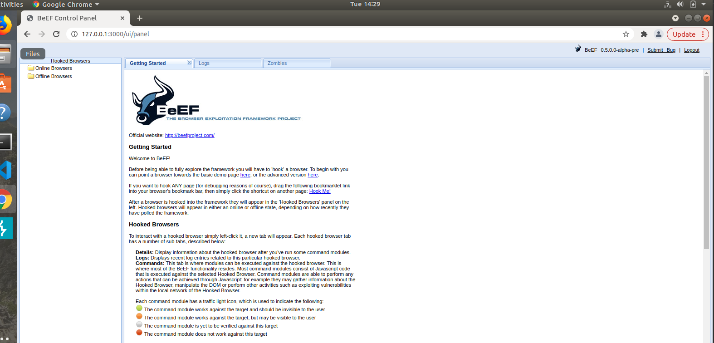

## Open BeEF in Linux Terminal

 

## Access the BeEF GUI from Linux Command Line

 

## You have successfully completed the setup when you have reached the BeEF Control Panel shown in the image below:

  
