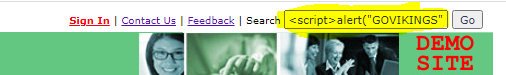
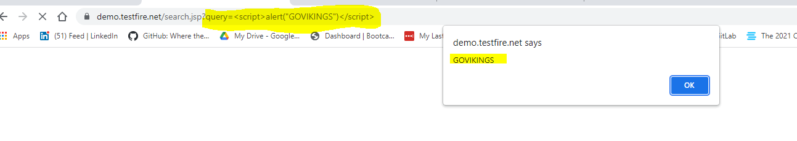

# Rob Myers: Week 16 Homework Penetration Testing 1

## Step 1: Google Dorking
---

1. ### Using Google, can you identify who the Chief Executive Officer of Altoro Mutual is:

    * Google Dorking Command: **"Intitle:"** 

    * Google Search Command: **"Intitle:Altoro Mutual CEO"**

    * **Altoro Mutual CEO is Karl Fitzgerald** 

 

### **Picture of the Altoro Mutual Website Executives & Management:**

### [AltoroMutual Management](IMAGE/1.PNG)
 

### <u> How can this information be helpful to an attacker: </U>

* This information can be usefull when attempting to deploy ransomeware or phishing attacks on executive management

## Step 2: DNS and Domain Discovery
---

1. ### Enter the IP address for `demo.testfire.net` into Domain Dossier and answer the following questions based on the results:

<u>Where is the company located:</U> 
 
* The company is located at: **Sunnyvale CA, 94085**

 

  <u>What is the NetRange IP address:</u>

* The NetRange is: **65.61.137.64 - 65.61.137.127**

  

  <U>What is the company they use to store their infrastructure:</U>

* Rackspace Backbone Engineering

 

  <u>What is the IP address of the DNS server:</U>

* 65.61.137.117

  

## Step 3: Shodan

1. ### What open ports and running services did Shodan find:

   * <u>Using shodan.io search:</u> **DNS Server 65.61.137.117**

   * <u>Ports Open are:</U> **80/TCP and 8080/TCP** 

   * **Port 443/TCP returned and error code**

### [Picture of Open Ports](IMAGE/port.PNG) 

## Step 4: Recon-ng

### Install the Recon module `xssed`.

### **NOTE:** All commands entered are from the Kali Linux Command Line

* Run: recon-ng
* marketplace search xssed
* marketplace install xssed
* modules load xssed 

  

### Set the source to `demo.testfire.net`. 

* options set SOURCE demo.testfire.net

 

### Run the module. 

* Enter Command: **run**

 

### Is Altoro Mutual vulnerable to XSS: 

* Yes, Altoro Mutual is vulnerable to XSS Attacks

 

### NOTE: Picture of Vulnerability from the XSSed.com website:

### [XSSed.com](IMAGE/xss.PNG)

### <u>Example: Testing the vulnerability</u> 

* Enter the following in the search box or address bar: 

 

### Picture of the script running in search bar: 

 

## Step 5: Zenmap

**Your client has asked that you help identify any vulnerabilities with their file-sharing server. Using the Metasploitable machine to act as your client's server, complete the following:**

1. ### **Command for Zenmap to run a service scan against the Metasploitable machine:** 

* nmap -sV -O -T3 -A -v 192.168.0.10
* -sV = Service and Version Scanning
* -O = OS Detection
* -T<0-5>: Set timing template (higher is faster)
* -A = Agressive Scanning
* -v = Verbrose
* 192.168.0.10 = Metasploitable IP

### [Zenmap Output](IMAGE/z1.PNG) 
 
2. ### **Output results into a new text file named `zenmapscan.txt`:** 

* nmap -sV -O -T3 -A -v -oN zenmapscan.txt 192.168.0.10

**NOTE: picture of the command after running and using the -oN command to OUTPUT the report to a TXT file**

### 3. **Use Zenmap's scripting engine to identify a vulnerability.**

### **Example running a script to identify a Vulnerability:** 

* nmap -sV -O -A --script ftp-vsftpd-backdoor 192.168.0.10 

**NOTE: Picture of the vulnerability exposed after being run in Zenmap. The scan revieled that the Metasploitable IP is exposed and vulnerable to this type of back door attack and the script was reported as showing a vulnerability since 2011 - 07 - 04.** 

### [Vulnerability Exposed](IMAGE/z4.PNG)

### [VSFTPD-BACKDOOR](IMAGE/z5.PNG)

### 4.  **Use Zenmap's scripting engine to identify a vulnerability. associated with the service running on the 139/445 port from your previous scan.**

### **Observations from the report:**

* <u>After running scan:</u> ftp-vsftpd-backdoor: concluded that server 192.168.0.10 is vulnerable to FTP attacks

* vsftpd 2.3.4 contains a backdoor which opens a shell on port 6200/TCP

* USER: Anonymous = FTP login allowed (FTP code 230). The server sends a 230 code in response to a command that has provided sufficient credentials to the server to grant the user access to the FTP server. 

* Open ftp vsftpd2.3.4 port 21/tcp is vulnerable to ftp-vsftdp-backdoor attacks

* Specificly Ports 139 and 445 are netbios-ssn. NetBIOS allows computers to communicate over a local network

* Port 139 is Samba smbd 3.x - 4.x (workgroup: WORKGROUP) NetBIOS uses port 139 to send and recieve information. It also appears that this port is associated with a Group USER : WORKGROUP that may have specific privledges.

* port 445 is Samba smbd 3.o.20 Debian (workgroup: WORKGROUP) It also appears that this port is associated with a Group USER : WORKGROUP that may have specific privledges.

* Suspect that USER: Anonymous has been added to the WORKGROUP via the ftp-vsftdp-backdoor vulnerability
 
### **Once you have identified this vulnerability, answer the following questions for your client:** 
  1. **What is the vulnerability:**

  * The vulnerability is that server 192.168.0.10 is vulnerable to FTP attacks
  * Specifically server 192.168.1.10 is vulnerable to the ftp-vsftpd-backdoor attack
  * vsftpd 2.3.4 contains a backdoor which opens a shell on port 6200/TCP

  2. **Why is it dangerous:**
  * This is dangerous becuase FTP helps keep file contents seccure durring transmission. If someone is able to create a back door and gain access to files that are meant to be secure then that is a security risk. A company could be exposing sensative and private information that they do not want unauthorized persons to see. 

  3. **What mitigation strategies can you recommendations for the client to protect their server:**

  * I would first make sure that all updates have ben completed. This will fix the known vsftpd vulnerabilities.
  * I would make sure that my filre wall has industry standard FTP rules configured (Data Encryption, Pass Word Protection)
  * This should also include TCP, API and other industry standard rules regarding network protection

---
© 2020 Trilogy Education Services, a 2U, Inc. brand. All Rights Reserved.  