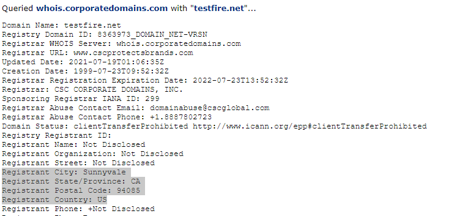

# Rob Myers: Week 16 Homework Penetration Testing 1

## Step 1: Google Dorking
---

1. ### Using Google, can you identify who the Chief Executive Officer of Altoro Mutual is:

    * Google Dorking Command: **"Intitle:"** 

    * Google Search Command: **"Intitle:Altoro Mutual CEO"**

    * **Altoro Mutual CEO is Karl Fitzgerald** 

 

**Picture of the Altoro Mutual Website Executives & Management:**

### [AltoroMutual Management](IMAGE/1.PNG)
 

### <u> How can this information be helpful to an attacker: </U>

* This information can be usefull when attempting to deploy ransomeware or phishing attacks on executive management

## Step 2: DNS and Domain Discovery
---

1. ### Enter the IP address for `demo.testfire.net` into Domain Dossier and answer the following questions based on the results:

<u>Where is the company located:</U> 
 
* The company is located at: **Sunnyvale CA, 94085**

 

  <u>What is the NetRange IP address:</u>

* The NetRange is: **65.61.137.64 - 65.61.137.127**

  

  <U>What is the company they use to store their infrastructure:</U>

* Rackspace Backbone Engineering

 

  <u>What is the IP address of the DNS server:</U>

* 65.61.137.117

  

## Step 3: Shodan

1. ### What open ports and running services did Shodan find:

   * <u>Using shodan.io search:</u> **DNS Server 65.61.137.117**

   * <u>Ports Open are:</U> **80/TCP and 8080/TCP** 

   * **Port 443/TCP returned and error code**

### [Picture of Open Ports](IMAGE/port.PNG) 

## Step 4: Recon-ng

### Install the Recon module `xssed`.

### **NOTE:** All commands entered are from the Kali Linux Command Line

* Run: recon-ng
* marketplace search xssed
* marketplace install xssed
* modules load xssed 

  

### Set the source to `demo.testfire.net`. 

* options set SOURCE demo.testfire.net

 

### Run the module. 

* Enter Command: **run**

 

### Is Altoro Mutual vulnerable to XSS: 

* Yes, Altoro Mutual is vulnerable to XSS Attacks

 

### NOTE: Picture of Vulnerability from the XSSed.com website:

### [XSSed.com](IMAGE/xss.PNG)

### <u>Example: Testing the vulnerability</u> 

* Enter the following in the search bar: 

 

## Step 5: Zenmap

Your client has asked that you help identify any vulnerabilities with their file-sharing server. Using the Metasploitable machine to act as your client's server, complete the following:

- Command for Zenmap to run a service scan against the Metasploitable machine: 
 
- Bonus command to output results into a new text file named `zenmapscan.txt`:

- Zenmap vulnerability script command: 

- Once you have identified this vulnerability, answer the following questions for your client:
  1. What is the vulnerability:

  2. Why is it dangerous:

  3. What mitigation strategies can you recommendations for the client to protect their server:

---
© 2020 Trilogy Education Services, a 2U, Inc. brand. All Rights Reserved.  