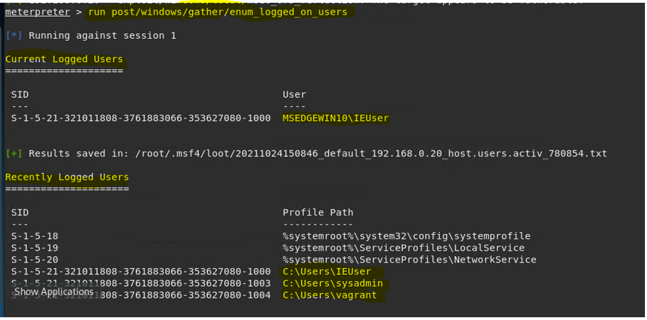

### Documenting Logged On USERS:

* using command: run post/multi/recon/local_exploit_suggester an attacker can view Logged On USER'S as well as Recently Logged ON USER'S
* this gives the attacker a tactical advantage to perform brute-force attacks and gain access to a USER's Username and Password
* this can be very easy for attackers if the server is vulnerable to XXS or injection vulnerabilities

 

