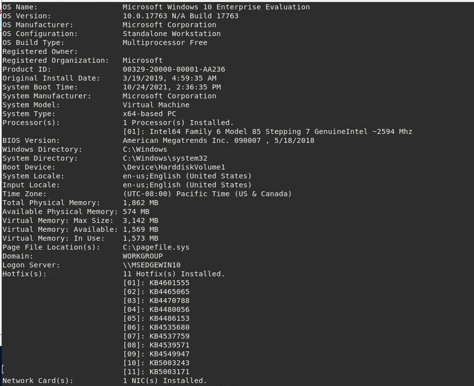

### Documenting the shell Command:

* Attackers will use Meterpreter shells to exfiltrate/download data from the target machine 
* Meterpreter shells provide the attacker with the ability to select an exploit and deliver Payloads to the target machine
* EXAMPLE of a popular payload: windows/meterpreter/reverse-tcp 

 

