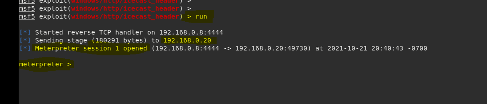

### Running the Exploit: exploit/windows/http/icecast_header 

* by performing this command the pen test team is successfully establishing a reverse shell connection, or a remote access connection.
* Basically, the attacker has successfully hacked the Server and has full access to download, steal or corrupt all data and or crash the entire network/server

