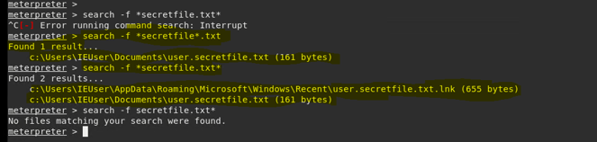

### Searching for the file: secretfile.txt

* run command search -f *secretfile*.txt
* Note that there are two results when the wild card is modified while searching 

### To view the "secretfile's" saved location:

 * C:\Users\IEUser\documents

 

### [View text of the files saved in Documents](12.PNG) 

### Curiosity killed the Kat

* find the other "secretfile.txt search: c:\Users\IEUser\AppData\Roaming\Microsoft\Windows\user.secretfile.txt.lnk

### [View user.secretfile.txt.lnk](13.PNG) 

