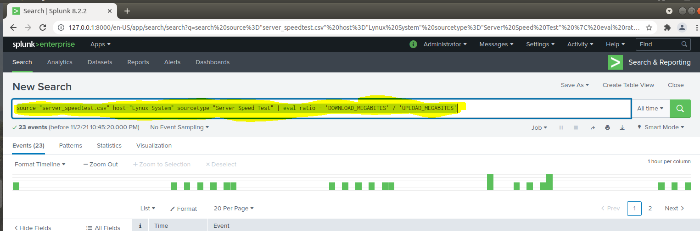
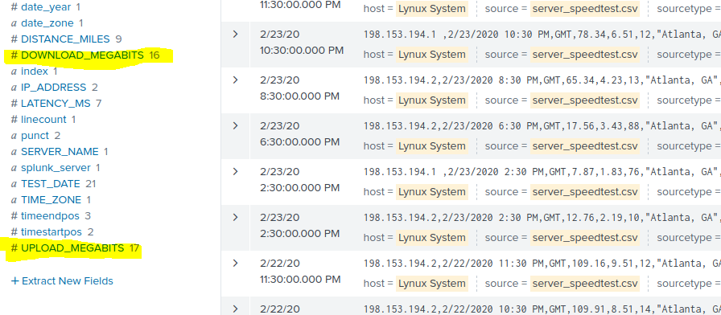

## Using the Eval Command:

**Example of the command:**

- source="server_speedtest.csv" host="Lynux System" sourcetype="Server Speed Test" | eval ratio = 'DOWNLOAD_MEGABITES' / 'UPLOAD_MEGABITES'

**NOTE: Command being entered into Splunk Search Bar**

 

**NOTE: The eval command created the DOWNLOAD_MEGABITS and UPLOAD_MEGABITS 
Values**

 