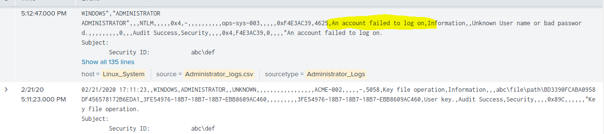
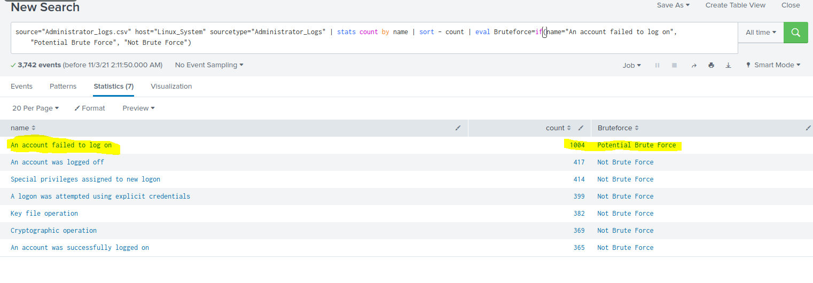
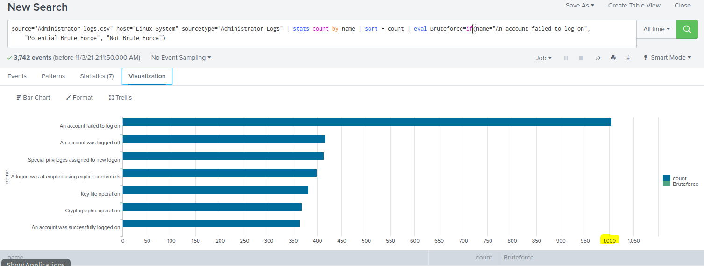
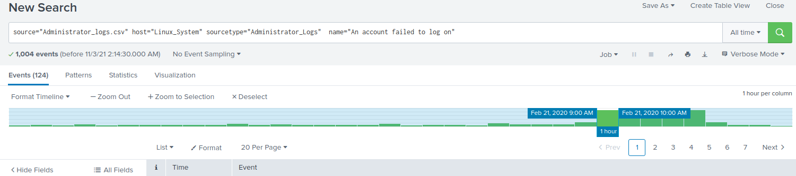
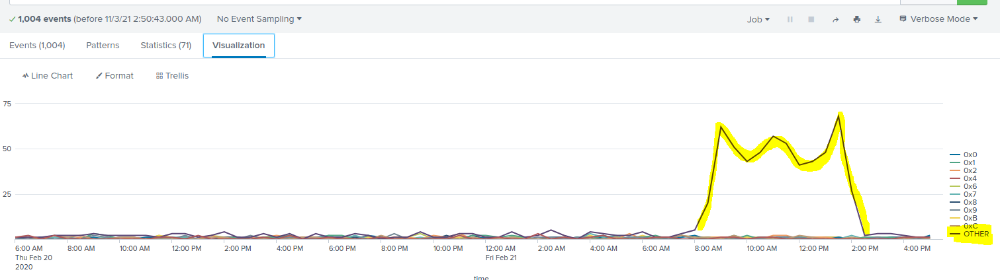
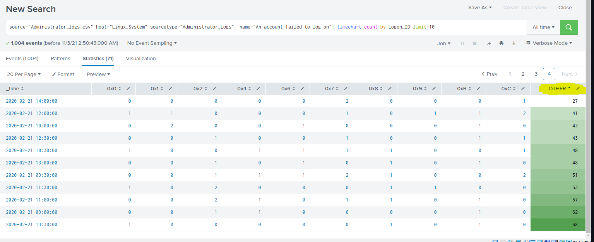

## Failed Login and Brute Force Report:

**Searching the Logs to determine appropriate "Name"**

* name="An account failed to log on"

 
___

Performing the search: 

* Using command: source="Administrator_logs.csv" host="Linux_System" sourcetype="Administrator_Logs" | stats count by name | sort - count | eval Bruteforce=if(name="An account failed to log on", "Potential Brute Force", "Not Brute Force")

* NOTE: see picture to demonstrate search results

 
___ 

* NOTE: see picture of graph to show results

 
___

NOTE: see picture of baseline and time's documenting the volume of FAILED LOG IN ATTEMPTS.

 
___

NOTE: High volume of FAILED LOGIN by User "OTHER" 
 

