# Rob Myers Week 20 Project 2: RED TEAM 

###  First things first: SET UP

### [SET UP](setup.md) 
---

## RED TEAM Pen Test: 

* Attempt to gain access to Summit Card Union Website: IP Address: 192.168.1.105
* Perform a Brute Force Attack
* Crack user passwords
* Establish Remote Access via Reverse Shell

### Enter the command: NMAP -sV 192.168.1.105

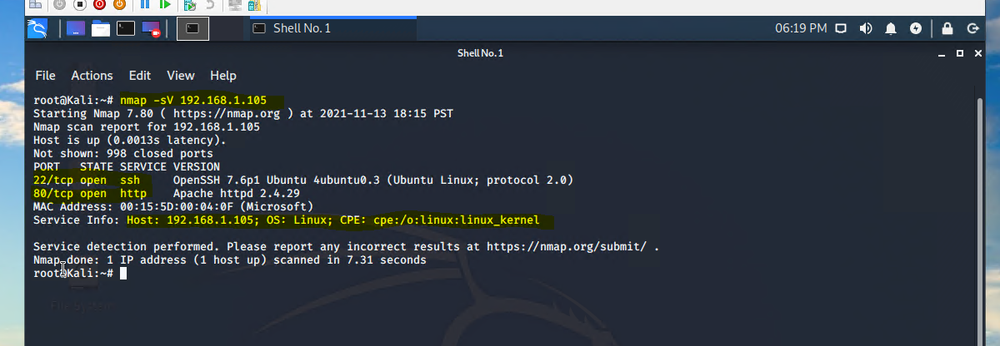

### From the Nmap scan we can see that port 80 is open. Open a web browser and Investigate the Summit Card Union Website for any potential vulnerabilities.

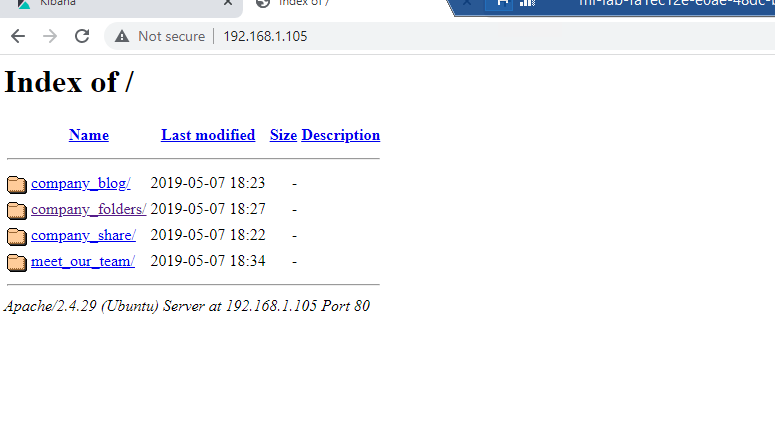

### Investigating the website you find access to the following:

- Company Blog
- Company Folders
- Company Share Folder
- Meet our Team Link

Click on the WEB SITE Link to see questionable vulnerabilities:

### [WEB SITE](website.md) 

### From our investigation navigating the Summit Card Union Website we discovered the "Secret Folder" is not accessible to the public. Lets try and find it!

* We discovered the error: "company_folders/secret_folder is no longer accessible to the public"

* This looks like a direct path to me and.........

* Look what we discovered!

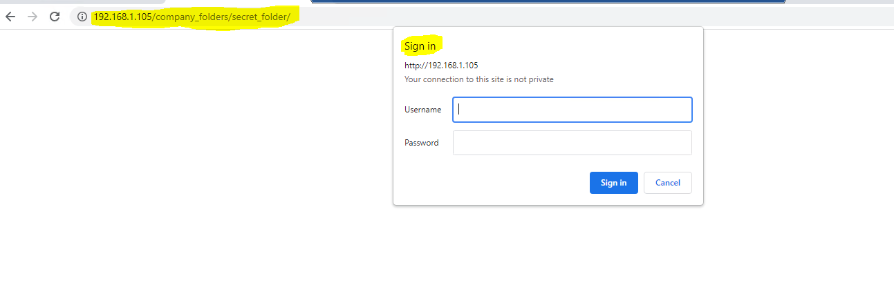 

### We know that Ashton manages the "Secret Folder". Lets try HYDRA and BRUTE FORCE to gain access to the Secret Folder.

### [BRUTE FORCE](brute.md) 

Now that we know Ashton's Username and Password from using Hydra, enter them into the Sign-in page:

* Username: ashton

* Password: leopoldo 

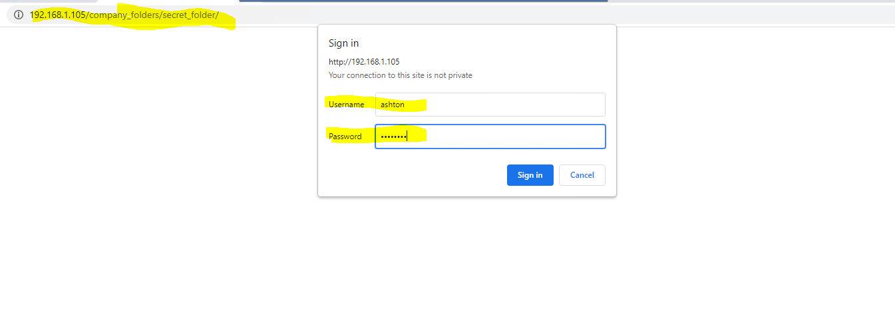 

## Success!!! 

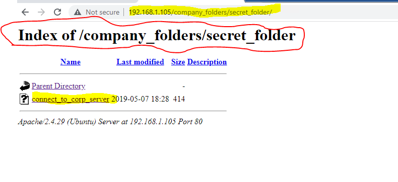 

### Click on Connect to corp server:

**NOTE**: Notice that there are instructions on how to establish a remote connection using the companies webdav server.

* NOTE: Ashton has access to Ryan's user name and password. This is another example of poor security practices

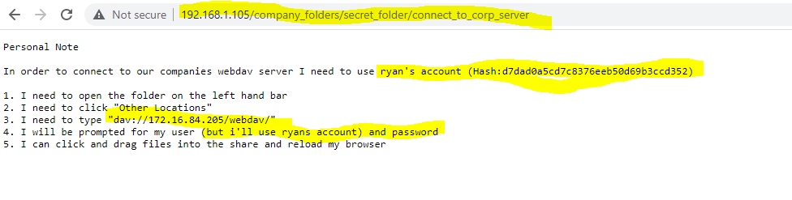 

### Connect to the WebDAV

* We need to crack Ryan's Hash to access his password:  Hash:d7dad0a5cd7c8376eeb50d69b3ccd352
* Connect to the server via WebDAV to establish a remote connection

### [Webdav](webdav.md) 

## Set up our reverse shell payload:

* We can establish our remote connection via WebDev and establish our reverse shell one of two ways:

    - Upload our PHP reverse shell payload using msfvenom 
    - Upload our PHP reverse shell payload using pre-installed web-shells in our LINUX Terminal

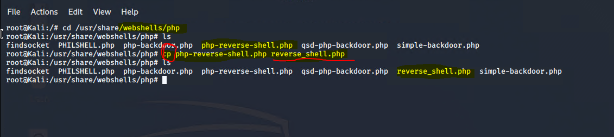 

### NOTE: Nano reverse_shell.php and set your local host IP (192.168.1.90) and Port (4444)

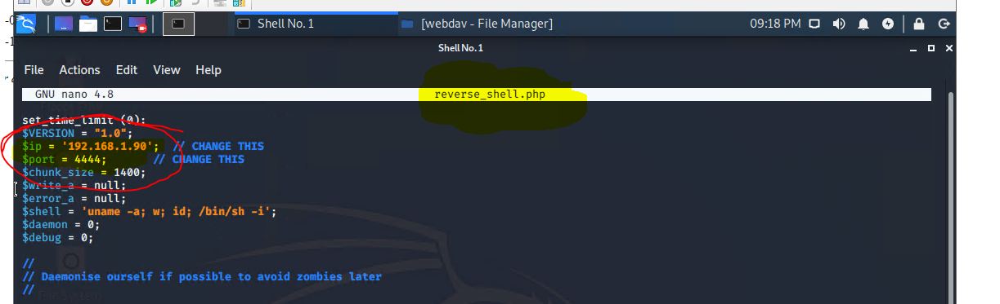

### Lets load our reverse_shell.php Payload into our WebDev to establish our (PHP)Reverse Shell

 

### Before we can deploy our payload to establish our reverse shell we need to run the Net Cat command to establish communication on port 4444

* nc -lvnp 4444

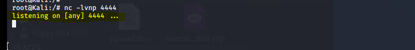 
  
### Now lets establish remote access control of the server (192.168.1.105) via our WebDav connection and deliver our payload effectively establishing a reverse shell

* Return to the website: 192.168.1.105/webdev

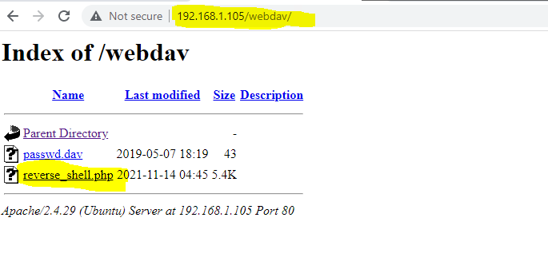  

* click on the reverse_shell.php to deliver the payload
* NOTE: if the connection is successful the webpage should "hang"
* Linux Terminal will also change from root@Kali to a $ symbol 

## You have now successfully established the reverse shell and have full control of all data in the server. 

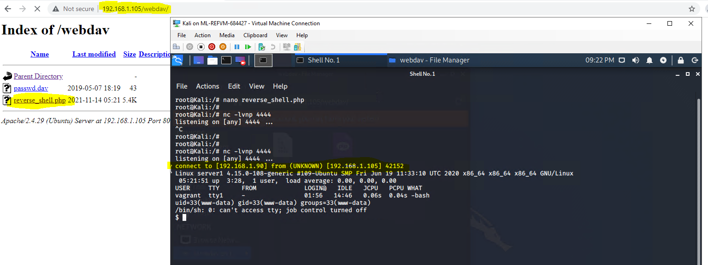  

### Picture: Example of the attacker having access to ROOT and changing directory to /USR

* The attacker could now download private, sensitive proprietary information, delete files, and or basically take down the entire server

  

