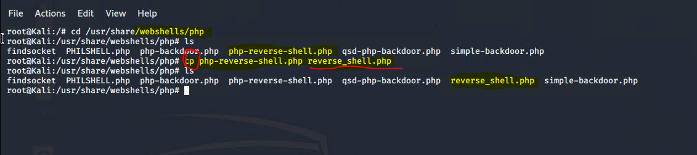
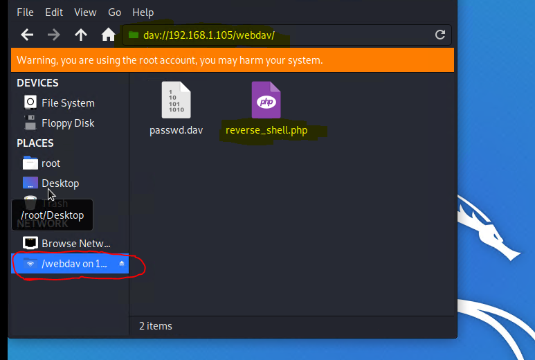
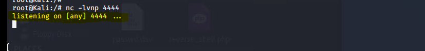
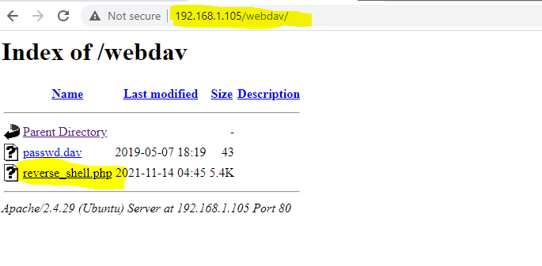
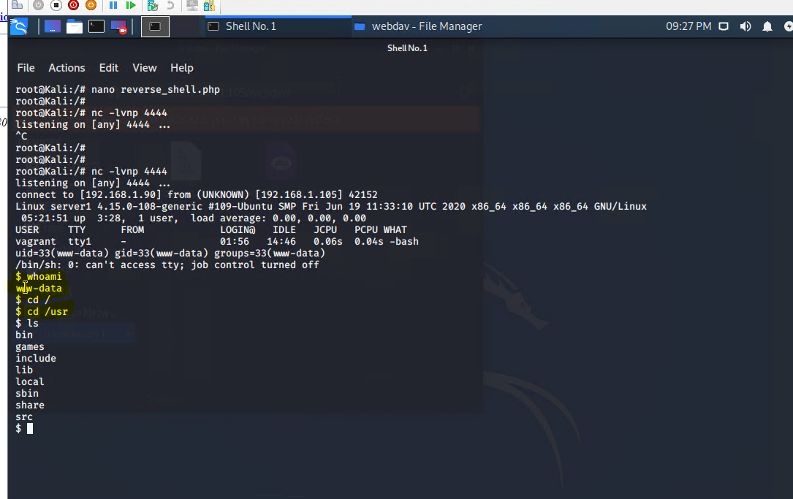

## Connect to WebDAV and Crack the HASH:

### There are several ways to break the password hash. Here, we simply used Crack Station, to avoid waiting for john to crack the password.

* NOTE that Ryan's password is: **linux4u**  

 

## Connect to the Summit Card Union Web Server via WebDAV

* The goal is to connect to the server (192.168.1.105) via WebDEV and establish a reverse shell 
* NOTE: Remember that you will be prompted to enter a User Name and Password.
* NOTE: Remember that we used CrackStation to get Ryans password (linux4u).
* NOTE: **Once you successfully enter Ryans credentials, you have succesfully created a remote access connection to the Summit Card Union Website: IP Address: 192.168.1.105** 

 

 

## Set up our reverse shell payload:

* We can establish our remote connection via WebDev and establish our reverse shell one of two ways:

    - Upload our PHP reverse shell payload using msfvenom 
    - Upload our PHP reverse shell payload using pre-installed webshells in our LINUX Terminal

 

NOTE: Nano reverse_shell.php and set your local host IP (192.168.1.90) and Port (4444)

Lets load our reverse_shell.php Payload into our WebDev establish our reverse shell

 

Before we can deploy our payload to establish our reverse shell we neeD to run the Net Cat command to establish communication on port 4444

* nc -lvnp 4444

 
  
Now lets establish remote access control of the server (192.168.1.105) via our WebDav connection and deliver our payload effectively establishing a reverse shell

* Return to the website: 192.168.1.105/webdev

  

* click on the reverse_shell.php to deliver the payload
* NOTE: if the connection is successful the webpage should "hang"
* Linux Terminal will also change from root@Kali to a $ symbol 

## You have now successfully established the reverse shell and have full control of the all data in the server. 

  

Picture: Example of the attacker having access to ROOT and changing directory to /USR

  

