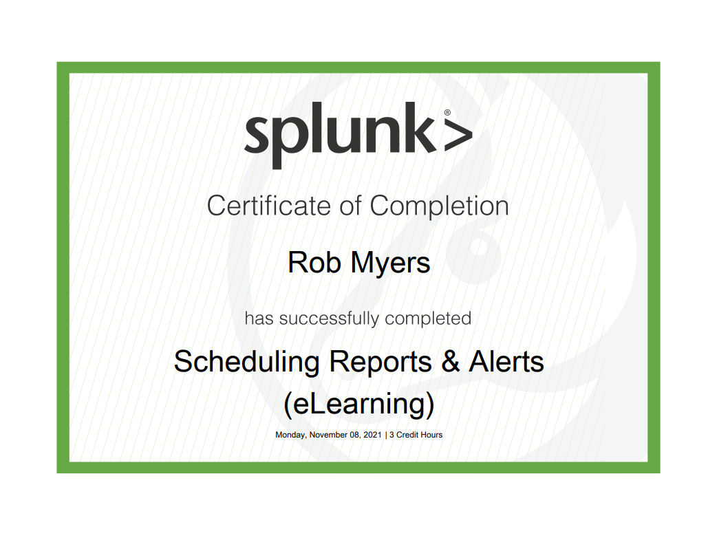

# Splunk Certifications:

Splunk is a software mainly used for searching, monitoring, and examining machine-generated Big Data through a web-style interface. Splunk performs capturing, indexing, and correlating the real-time data in a searchable container from which it can produce graphs, reports, alerts, dashboards, and visualizations. It aims to build machine-generated data available over an organization and is able to recognize data patterns, produce metrics, diagnose problems, and grant intelligence for business operation purposes. Splunk is a technology used for application management, security, and compliance, as well as business and web analytics.

 

---

 

---

---

 

---

 

---

