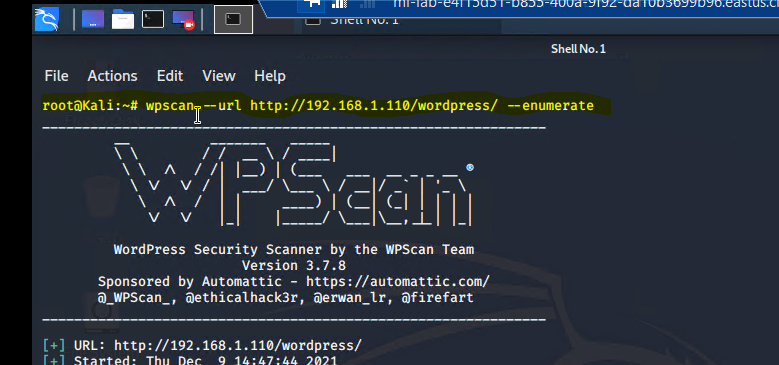
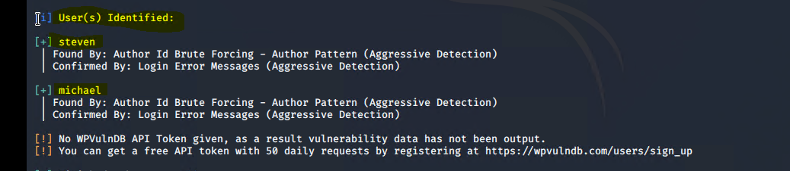
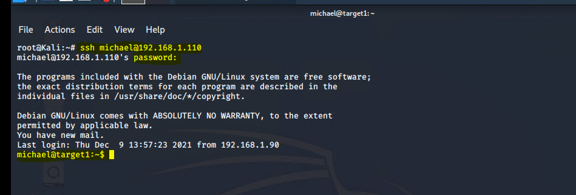
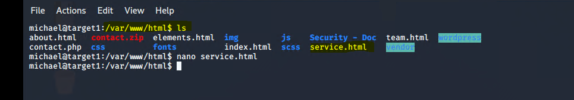
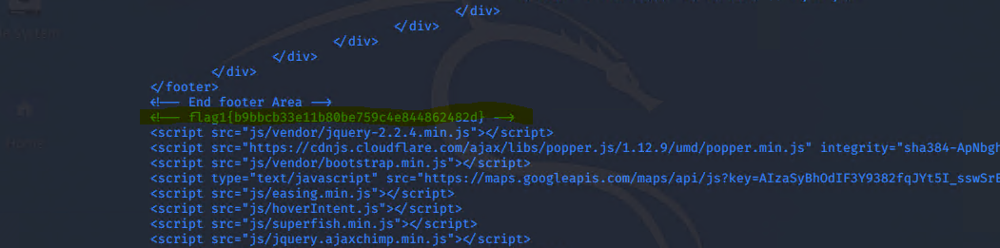

# Flag 1 Pictures

## The Red Team was able to penetrate Target 1 and retrieve the following confidential data:

Target 1: 192.168.1.110

* Flag1: b9bbcb33ellb80be759c4e844862482d

**Exploit Used:**

WPScan to enumerate users of the Target 1 WordPress site

* Command: wpscan --url http://192.168.1.110/wordpress/ --enumerate u

## wpscan also reveled TWO user(s) Identified:

* Steven
* Michael

 

## Red Team used SSH to gain access to Michaels account

* ssh michael@192.168.1.110 
* Red Team was able to guess Michaels password by using his name: michael
* Red Team located flag 1 by navigating through Directories and located the flag 

### SSH Picture:

 

### Locating Flag 1:

 

