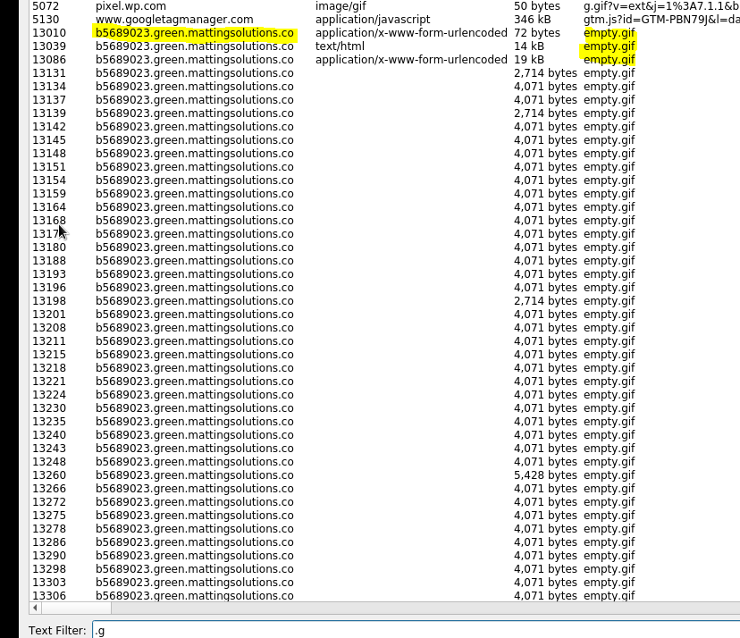

# Network Forensic Analysis Report

## Overview:

**You are working as a Security Engineer for X-CORP, supporting the SOC infrastructure. The SOC analysts have noticed some discrepancies with alerting in the Kibana system and the manager has asked the Security Engineering team to investigate.**

**You will monitor live traffic on the wire to detect any abnormalities that aren't reflected in the alerting system. You are to report back all your findings to both the SOC manager and the Engineering Manager with appropriate analysis.**

**The Security team requested this analysis because they have evidence that people are misusing the network. Specifically, they've received tips about:**

* "Time thieves" spotted watching YouTube during work hours.
* At least one Windows host infected with a virus.
* Illegal downloads.

**A number of machines from foreign subnets are sending traffic to this network. Your task is to collect evidence confirming the Security team's intelligence.**

## Time Thieves 

**At least two users on the network have been wasting time on YouTube. Usually, IT wouldn't pay much mind to this behavior, but it seems these people have created their own web server on the corporate network. So far, Security knows the following about these time thieves:**

* They have set up an Active Directory network.
* They are constantly watching videos on YouTube.
* Their IP addresses are somewhere in the range 10.6.12.0/24.

**You must inspect your traffic capture to answer the following questions:**

1. **What is the domain name of the users' custom site?**

    * Wireshark Filter: **ip.addr == 10.6.12.0/24**
    * Domain Name: **frank-n-frankted-dc.frank-n-ted.com**

 

2. **What is the IP address of the Domain Controller (DC) of the AD network?**

    * Wireshark Filter: **ip.addr == 10.6.12.0/24**
    * Domain Name: **frank-n-frankted-dc.frank-n-ted.com (10.6.12.12)**

3. **What is the name of the malware downloaded to the 10.6.12.203 machine?**

    * Wireshark Filter: **ip.addr == 10.6.12.203 and http.request.method = = GET**
    * Malware Downloaded: **june11.dll**

- **Once you have found the file, export it to your Kali machine's desktop.**

    * **File > Export Object > HTTP**

 

4. **Upload the file to [VirusTotal.com](https://www.virustotal.com/gui/).** 

 

5. **What kind of malware is this classified as?**

    * Malware Classification: **Trojan** 

 

---

## Vulnerable Windows Machine

**The Security team received reports of an infected Windows host on the network. They know the following:**

* Machines in the network live in the range 172.16.4.0/24.
* The domain mind-hammer.net is associated with the infected computer.
* The DC for this network lives at 172.16.4.4 and is named Mind-Hammer-DC.
* The network has standard gateway and broadcast addresses.

1. **Find the following information about the infected Windows machine:**

    - Host name: **Rotterdam-PC.mind-hammer.net**
    - IP address **172.16.4.205** 
    - MAC address **00:59:07:b0:63:a4**
    - Wireshark Filter: **ip.src == 172.16.4.0/24**

    
2. **What is the username of the Windows user whose computer is infected?**

- Wireshark Filter: **ip.src == 172.16.4.0/24 and kerberos.CName.String**
- User Name: **matthijs.devries**

3. **What are the IP addresses used in the actual infection traffic?**

* Four IP Address with High Packet Volume
* 172.16.4.205 (Rotterdam-PC.mind-hammer.net)
* 185.243.115.84 (b5689023.green.mattingsolutions.co)
* 166.62.111.64 (mysocalledchaos.com)
* 31.7.62.214 (fake URL website)

**Digging Deeper**

**Reviewing traffic between 172.16.4.205 (Rotterdam-PC.mind-hammer.net) and 185.243.115.84 (b5689023.green.mattingsolutions.co) a high volume of files were down loaded: **"empty.gif"**

 

**Example of the file empty.gif**

 

**Traffic between 172.16.4.205 (Rotterdam-PC.mind-hammer.net) and 31.7.62.214 reveal 31.7.62.214 is a fake URL download website.**

 

4. **As a bonus, retrieve the desktop background of the Windows host.**

**185.243.115.84 (b5689023.green.mattingsolutions.co) had a lot of empty.gif. I went back through the HTTP Object List and discovered the following:**

* empty.gif?ss&ss1
* empty.gif?ss&ss2

 

**Picture of Desktop Background from the Windows Host:** 

  

---

## Illegal Downloads

1. **Find the following information about the machine with IP address 10.0.0.201:**

- MAC address: **00:16:17:18:66:c8**
- Wireshark Filter: **ip.addr == 10.0.0.201**

 

- Windows username: **elmer.blanco**
- Wireshark Filter: **ip.addr == 10.0.0.201 and kerberos.CName.String**

 

- OS version: **Windows NT 10.0**
- Wireshark Filter: **ip.addr == 10.0.0.201 and http.request**
    - **Right click > Follow > TCP Stream**

 

2. **Which torrent file did the user download?**

- Wireshark Filter: **ip.src == 10.0.0.201 and http.request.method == GET**
    - **Look for a Torrent File** 

  

**Once you have found the file, export it to your Kali machine's desktop.**

* **File > Export Object > HTTP**
* **Save to /root/Documents**

 

### Movie Downloaded was Betty Boop Rhythm on the Reservation.avi

## https://archive.org/details/BettyBoopTheater11

