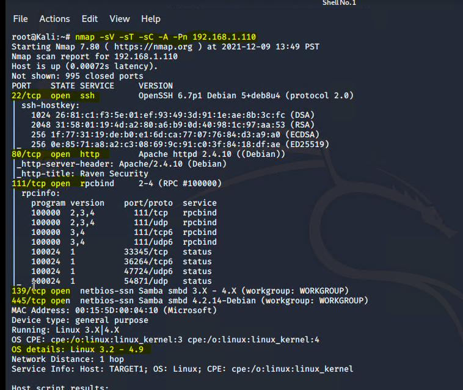

# Red Team: Summary of Operations

## Table of Contents
- Exposed Services
- Critical Vulnerabilities
- Exploitation

## Exposed Services

## **Nmap scan results for each machine reveal the below services and OS details:**
  * nmap -sV -sT -sC -A -Pn 192.168.1.110

## **This scan identifies the services below as potential points of entry:**

  - Target 1: 192.168.1.110
  - Port 22/TCP Open SSH
  - Port 80/TCP Open HTTP
  - Port 111/TCP Open rpcbind
  - Port 139/TCP Open netbios-ssn
  - Port 445/TCP Open netbios-ssn 
  - OS: Linux 3.2 - 4.9

## **The following vulnerabilities were identified on Target 1: 192.168.1.110:**

### Critical Vulnerabilities:

  * Open SSH [CVE-2021-28041](https://nvd.nist.gov/vuln/detail/CVE-2021-28041)
    * Red Team was able to Log in with two user ID's via SSH
  * Apache https 2.4.10 [CVE-2017-15710](https://nvd.nist.gov/vuln/detail/CVE-2017-15710)
    * See known vulnerability link
  * Open rpcbind port [CVE02017-8779](https://nvd.nist.gov/vuln/detail/CVE-2017-8779)
    * See known vulnerability link
  * Samba NetBIOS [CVE-2017-7494](https://nvd.nist.gov/vuln/detail/CVE-2017-7494)
    * See known vulnerability link
  * Network Mapping and User Enumeration (WordPress Site)
    * Red Team was able to successfully exploit WordPress vulnerabilities
  * Weak User Password
    * Red Team was able to guess user password
  * Unsalted user Password Hash 
    * Wpscan was used to gain access to username password
 and password info 
    * John was used to crack the password hash
  * MySQL Database Access
    * Red Team was able to gain login access to the MySQL database  
  * Red Team was able to successfully locate all 4 "Flags"   

## Exploitation

**The Red Team was able to penetrate Target 1:192.168.1.110 and retrieve the following confidential data:**

**Target 1: 192.168.1.110**

## Flag 1:

The Red Team was able to successfully locate Flag 1: 

* Flag 1: b9bbcb33ellb80be759c4e844862482d 

**Exploit Used** 

* Red Team used wpscan to enumerate the WordPress Website and identify two User(s): Steven and Michael 
* Red Team used SSH to gain access to Michaels account
* Red Team was able to guess Michaels Password and successfully gain access to the server
* Red Team located the Flag at: /var/www/html/service.html 

## [Flag 1 Pictures](IMAGE/1.md)

## Flag 2:

The Red Team was able to successfully locate Flag 2: 

* Flag 2: fc3fd58dcdad9ab23faca6e9a3e581c 

**Exploit Used** 

* The Red Team continued to navigate through the WebPress Server via SSH
* Red Team located the Flag at: /var/www/flag2.txt  

## [Flag 2 Pictures](IMAGE/2.md) 

## Flag 3:

The Red Team was able to successfully locate Flag 3:  

* Flag 3: afc01ab56b50591e7dccf93122770cd2

**Exploit Used** 

* The Red Team continued to navigate through the WebPress Server via SSH
* Red Team navigated to /var/www/html/wordpress/wp-config.php and discovered the USERNAME and PASSWORD to the MySQL Database
* The Red Team used the user name and password to log into the MySQL Data Base

Red Team used the following commands to locate Flag 3 inside the MySQL Data Base:
  * mysql -u root -p
  * User Name: root
  * Pass Word: R@v3nSecurity
  * Show databases;
  * Command: use wordpress
  * Command: showtables;
  * select * from wp_posts;

## [Flag 3 Pictures](IMAGE/3.md) 

## Flag 4:

The Red Team was able to successfully locate Flag 4: 

* Flag 4: 715dea6c055b9fe3337544932f2941ce

**Exploit Used** 

* The Red Team continued to navigate through the MySQL Database and was successful at locating TWO User Password HASH's
* The Red Team used John to crack the pass words 
  * john --wordlist=/usr/share/wordlists/rockyou.txt wp_hashes
* The Red Team SSH into Steven Account
  * ssh steven@192.168.1.110
  * Password: pink84 
 * The Red Team was able to escalate to root 
  * sudo python -c "import pty;pty.spawn('/bin/bash')"  

## [Flag 4 Pictures](IMAGE/4.md) 

