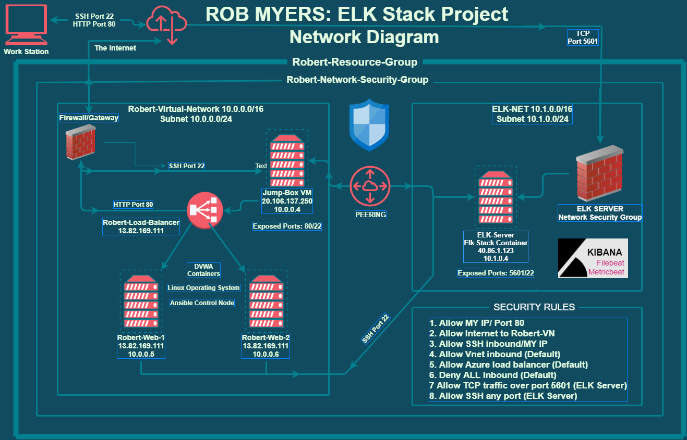
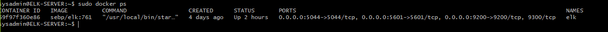
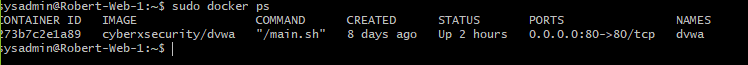
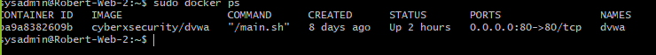
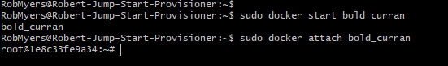
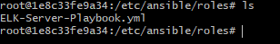
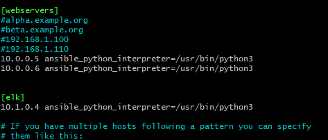

# Rob Myers ELK Stack Project:
 **October 6th, 2021 -- University of Minnesota - Cybersecurity Boot Camp**

 ## This document/project contains the following details:
- Description of the Topology

  [Azure-ELK-Network](IMAGE/ELK_NET.PNG)

  [Azure-Jump-Box](IMAGE/jumpstart_network.PNG)

  [Azure-VM-Network](IMAGE/Robert_virtual_network.PNG)

  [Rob Myers Network Diagram](IMAGE/project1.png)

- Access Policies
- ELK Configuration
- Beats in Use
- Machines Being Monitored
- How to Use the Ansible Build

## Automated ELK Stack Deployment

### The files in this repository were used to configure the network depicted below.

 

   

    
  <brk>

### These files have been tested and used to generate a live ELK deployment on Azure. They can be used to recreate the entire deployment pictured above or select portions of the **yaml** file's may be used to install only certain pieces of it. Below are links to the files: 

  - **Ansible File** 

    * [Ansible.cfg File](IMAGE/ansible.yml)
      *  /etc/ansible 

 
   
  - **Hosts File**
    * [Hosts File](IMAGE/hosts.yml) 
      * /etc/ansible

 
  
  - **DVWA** 
    * [DVWA-Pentest](IMAGE/pentest.yml)
      * /etc/ansible

  - **ELK-Configuration** 

    * [ELK-Playbook](IMAGE/install-elk.yml)
      * /etc/ansible/roles

  - **Filebeat**

    * [Filebeat Configuration](IMAGE/filebeat-config.yml)
    * [Filebeat Playbook](IMAGE/filebeat-playbook.yml)
      * /etc/ansible/files

  

  - **MetricBeat**

    * [MetricBeat Configuration](IMAGE/metricbeat-config.yml)
    * [MetricBeat Playbook](IMAGE/metricbeat-playbook.yml)
      * /etc/ansible/files

  
### Description of the Topology

The main purpose of this network is to expose a load-balanced and monitored instance of DVWA, the D*mn Vulnerable Web Application.

Load balancing ensures that the application will be highly **efficient and flexible**, in addition to restricting **traffic** to the network.

- **What aspect of security do load balancers protect?** 
  * Load balancers help protect the network against hackers and attacks like DDoS attacks. 
  * They allow for daily rule updates and help protect against unauthorized access.   
  * They also also reduce the load in-order to achieve optimal traffic speed.
  * Load balancers are also helpful at accommodating failed or under performing servers/components to maintain user service.
  
<brk>

- **What is the advantage of a jump box?**

  * A Jump Box Provisioner is also important as it prevents Azure VMs from being exposed via a public IP Address. This allows us to do monitoring and logging on a single box. 
  * The main benefits of JumpBox are its extensive software library, automated backups, and customizations.

Integrating an ELK server allows users to easily monitor the vulnerable VMs for changes to the  **network** and system **logs**.

- **What does Filebeat watch for?**

  * Filebeat is a lightweight shipper for forwarding and centralizing log data.
  * Filebeat watches and monitors the log files, user specific locations, collects log events and forwards them either to Elasticsearch or Logstash for indexing. 

- **What does Metricbeat record?**

  * Metricbeat is a lightweight shipper that records and periodically collects metrics from the operating system.
  * It also takes metrics and statistics from services running on the server and takes the data collected and ships them to the output that users specify, such as Elasticsearch or Logstash.

The configuration details of each machine may be found below.
_Note: Use the [Markdown Table Generator](http://www.tablesgenerator.com/markdown_tables) to add/remove values from the table_.

| Name     | Function | IP Address | Operating System |
|----------|----------|------------|------------------|
| Jump Box | Gateway  | 10.0.0.1   | Linux            |
| ELK VM   | ELK Stack |  10.0.0.4 | Linux            |
| Robert-WEB-1    | DVWA Server| 10.0.0.5|Linux       |
| Robert-WEB-2    | DVWA Server| 10.0.0.6| Linux      |

### Access Policies

**The machines on the internal network are not exposed to the public Internet.** 

Only the **Jump-Box-Provisioner** machine can accept connections from the Internet. **Access to this machine is only allowed from the following IP addresses:**

- **My Home/Personal IP Address listed in INCOMING RULES/NETWORKING SECURITY GROUPS**
- **also can only be accessed using SSH**
 
Machines within the network can only be accessed by **Jump-Box-Provisioner 10.0.0.4**.

- **Which machine did you allow to access your ELK VM AND what was its IP Address?**

    * Jump-Box VM: 10.0.0.4 via port 22 (SSH)
    * MyHOME/Personal IP Address: Port 5601 (TCP)

**A summary of the access policies in place can be found in the table below.**

| Name     | Publicly Accessible | Allowed IP Addresses |
|----------|---------------------|----------------------|
| Jump Box | Yes              |     MY Home/Personal IP |
| ELK VM   | Yes              |     MY Home/Personal IP |
| Robert-WEB-1    | No               |     10.0.0.6            |
| Robert-WEB-2    | No               |     10.0.0.7            |  

### Elk Configuration

Ansible was used to automate configuration of the ELK machine. No configuration was performed manually, which is advantageous because.

- **What is the main advantage of automating configuration with Ansible?**

  * One main advantage is Ansible is an open-source tool.
  * Ansible uses a simple syntax written in YAML, called playbooks.
  * Ansible lets you define your hosts (remote machines) and allows you to control multiple servers via SSH.
  * Automation advantage vs manual configuration is time. That is why Ansible is such a useful tool.
  * Automation with Ansible also reduces the chance of errors and improves consistency
 
**The playbook implements the following tasks:**

In 3-5 bullets, explain the steps of the ELK installation play. E.g., install Docker; download image; etc.

  [ELK-Playbook](IMAGE/install-elk.yml) 

**1. Name the playbook: Configure elk with Docker**

  - establish host, remote user, and root.

**2. Use apt and pip modules: Install Applications**

  - Docker.io, Python3-pip, Docker module.

**3. Use command module: Increase virtual memory**

  - command: sysctl -w vm.max_map_count=262144.

**4. Use sysctl module: Use more memory**

  - assigns more memory.

**5. Use docker-container module: download and launch a docker elk container**

  - down loads the elk container and assigns
 ports that ELK can run on:
     - published_ports:
          - 5601:5601
          - 9200:9200
          - 5044:5044

## The following screenshot displays the result of running `docker ps` after successfully configuring the ELK instance.

**ELK Server:**

**Robert-Web-1**

**Robert-Web-2**

### Target Machines & Beats
**This ELK server is configured to monitor the following machines:**
- Robert-Web-1: 10.0.0.5
- Robert-Web-1: 10.0.0.6

**We have installed the following Beats on these machines:**
- Filebeat
- MetribBeat

**These Beats allow us to collect the following information from each machine:**

- **Filebeat** will be used to collect log files from very specific files such as Apache, Microsoft Azure tools and web servers, MySQL databases.

  [Filebeat-Status](IMAGE/Filebeat-Status.PNG)

- **Metericbeat** will be used to monitor VM stats, per CPU core stats, per filesystem stats, memory stats and network stats.

  [Metricbeat-Status](IMAGE/Metricbeat-Status.PNG)

- Examples of Filebeat and Metricbeat logs:

    [Filebeat-Log](IMAGE/Filebeat-chart.PNG)

    [Metricbeat-Log](IMAGE/Metricbeat-chart.PNG)

### Using the Playbook
In order to use the playbook, you will need to have an Ansible control node already configured. Assuming you have such a control node provisioned: 

**SSH into the control node and follow the steps below:**

- ssh < username >@< IP Address >

- sudo docker start < docker container name > 
- sudo docker attach < docker container name > 

- Copy the **ELK-Server-Playbook.yml to /etc/ansible/roles**.

  

- Update the **hosts file to include the ELK machines local IP address**

  - /etc/ansible
  - nano hosts

  

To run the playbook use command: **ansible-playbook ELK-Server-Playbook.yml**

To check that the installation worked: **http://[your_ELK_Machine's_Public_IP]:5601/app/kibanato** 

  * **ansible-playbook ELK-Server-Playbook.yml**

      [Run Play Book](IMAGE/w.PNG)

  * **http://[your_ELK_Machine's_Public_IP]:5601/app/kibanato**

      [Check Instalation](IMAGE/e.PNG)

As a **Bonus**, provide the specific commands the user will need to run to download the playbook, update the files, etc.

[Playbook and download commands](IMAGE/exc.PNG) 

[Cheat-Sheet](IMAGE/cheat.md) 

