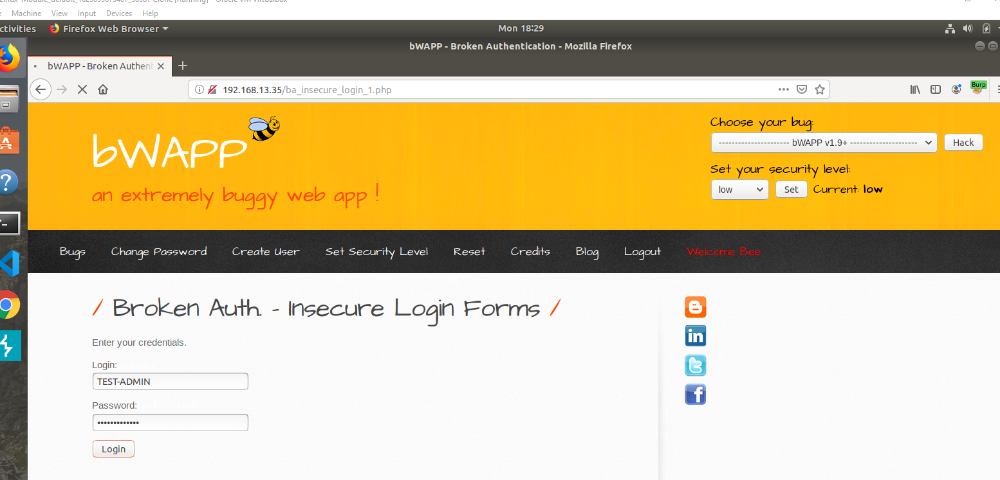
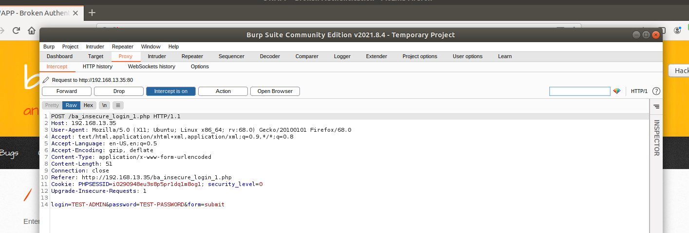
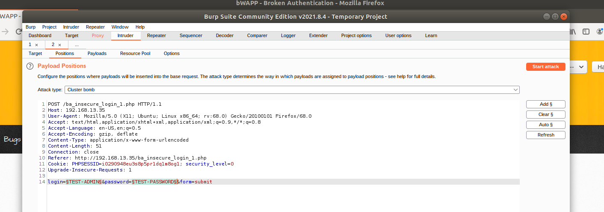
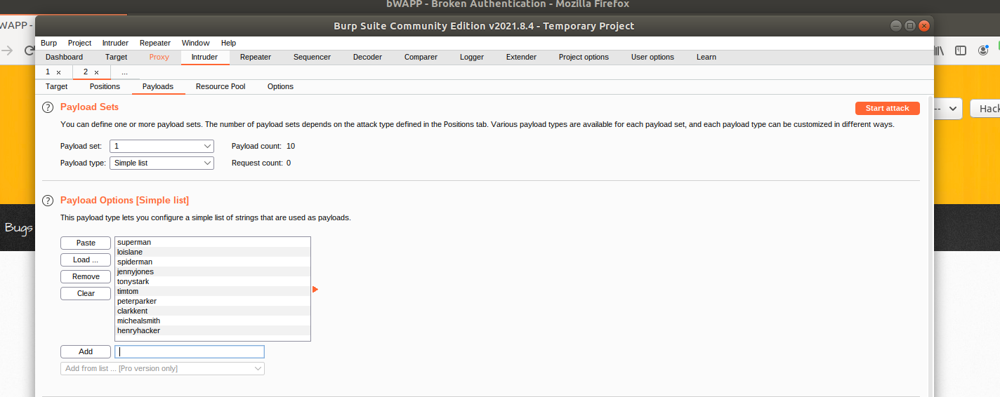
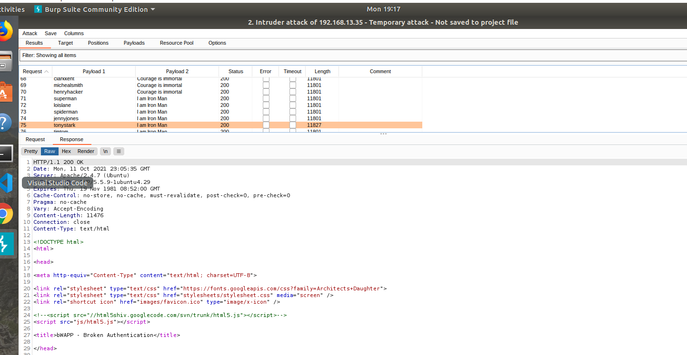
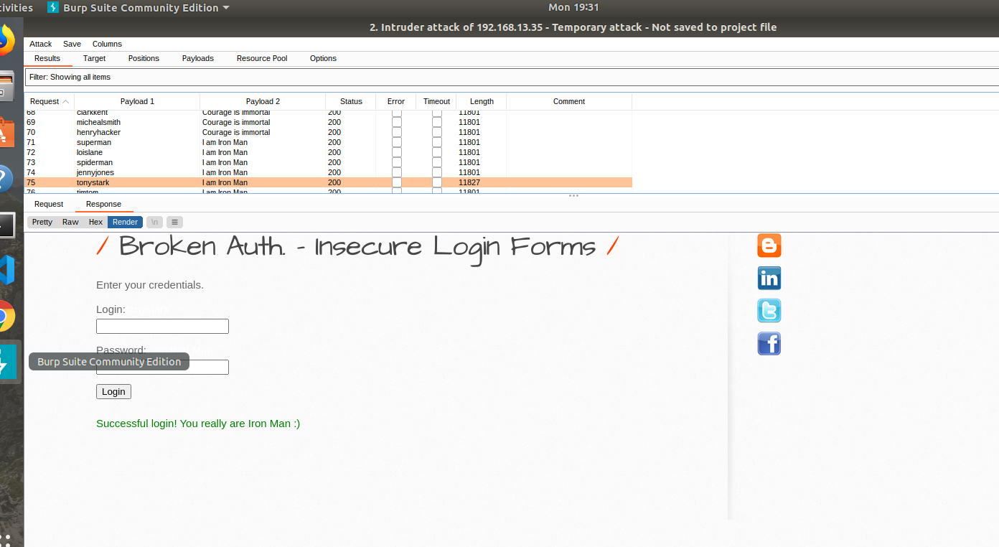

## <u>Using BURP to test the Login page</u> 

* User name: TEST-ADMIN
* Password: TEST_PASSWORD

 

## <u>BURP Dashboard: HTTP request with Burp Intecept</U> 

* Note that the HTTP request contains the username and password that were entered

 

## <u>Configure the Burp Intruder Positions</u>

* We will be using a Cluster Bomb Attack Type and will be testing two payloads, the username and password

* Note that all payload markers have been cleared except for TEST-USER and TEST-PASSWORD

## <u>Configure the Burp Intruder Payloads</U>

* Under Payload Set: 1 = user names 
* Under Payload Set: 2 = Password
* Enter the stolen Administrators List and Breached Passwords into the Payload Options

### Picture of usernames entered into Payload Set:1

### Picture of passwords entered into Payload Set:2

## <u>Launch the brute force attack and analyze the results.</u>

### Results of the attack 

* **NOTE:** There were 100 results

* When reviewing the results ALL except ONE result had the same "length"

* The result that was different from the other ones was the following:

    * Payload 1: tonystark
    * Payload 2: I am Iron Man
    * Length was 11827 compared to the other Lengths of 11801

* Click on the Render Tab to see what the website login page will display

* **NOTE:** The combonation of tonystark and I am Iron Man was the correct username and password

### Picture of the successfull Login:

 

