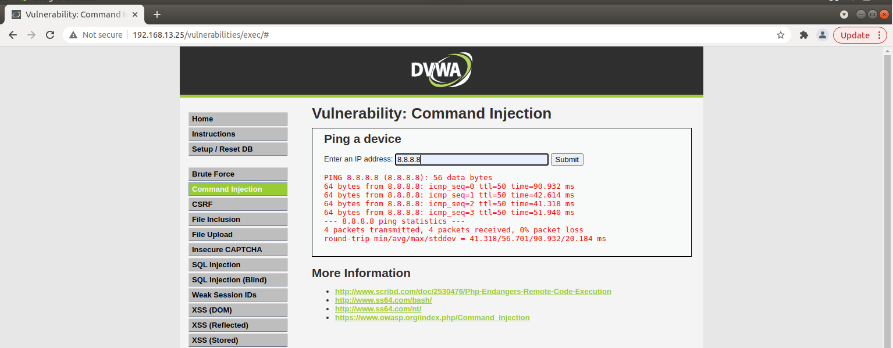
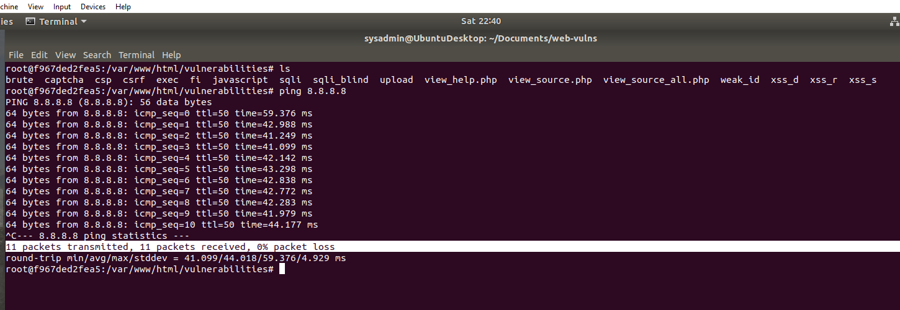

## Picture using PING via the DVWA Website
* ping 8.8.8.8

## Picture using PING in Linux Command Line
* ping 8.8.8.8
* **Note** that 11 packets transmitted, 11 packets recieve, 0% packet loss

 

