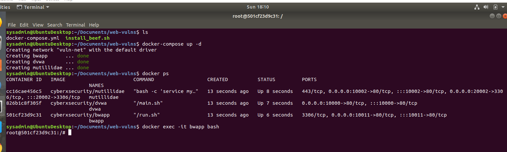
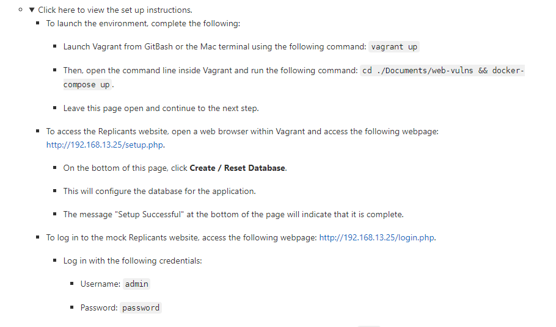

## Setting up the BWAPP Docker Container in Linux Command Line

  

<brk>

 
## Set up BWAPP Web Instructions

* Open a browser on Vagrant and navigate to the webpage http://192.168.13.35/install.php.

* Install bWapp 

* Login to bWapp website and enter in the following URL: http://192.168.13.35/ba_insecure_login_1.php

* If the user/password combination is correct, it will return a successful message.

 

