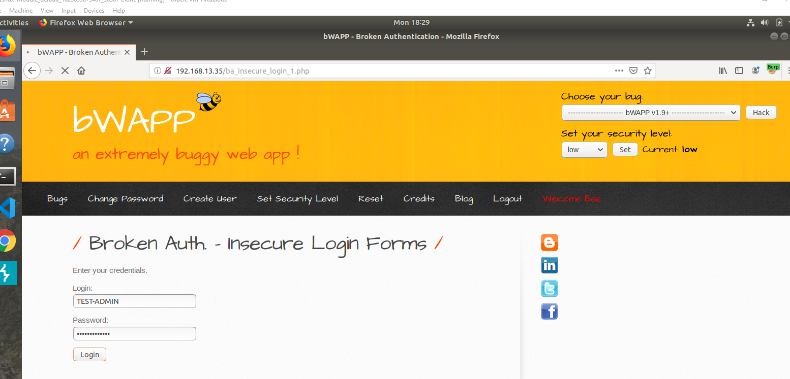
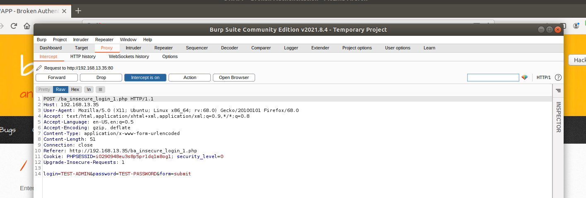
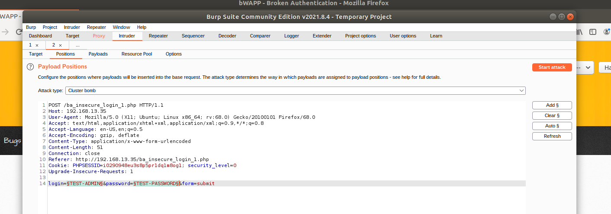
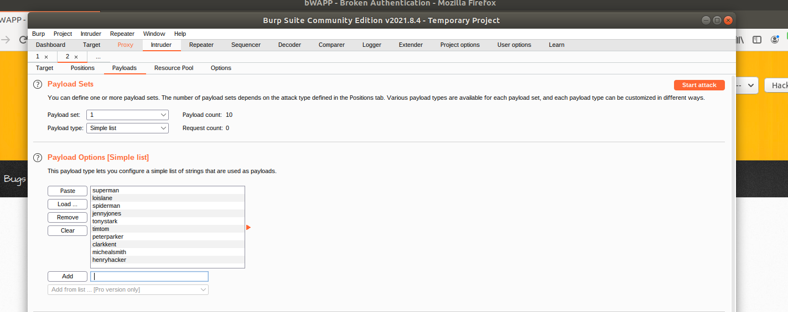
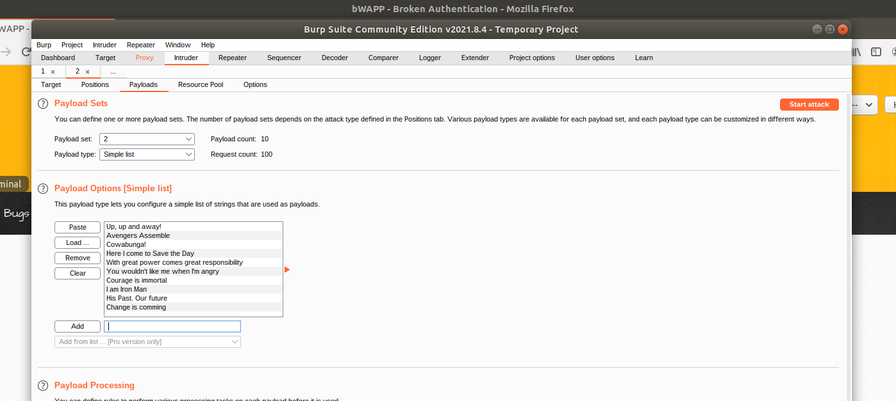
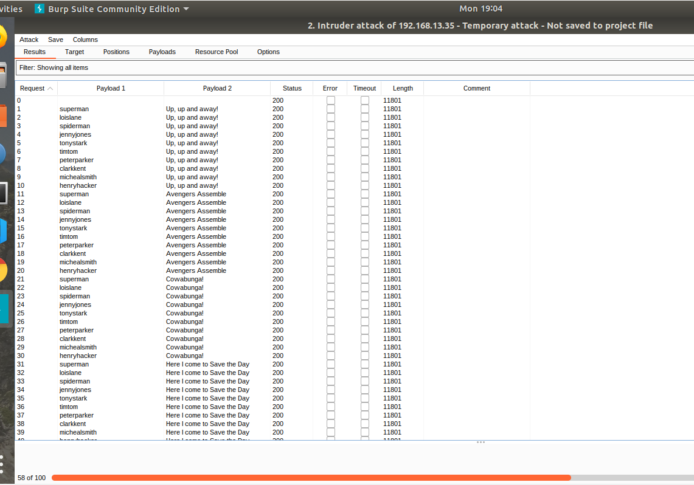

## Using BURP to test the Login page

* User name: TEST-ADMIN
* Password: TEST_PASSWORD

 

## BURP Dashboard: HTTP request with Burp Intecept

* Note that the HTTP request contains the username and password that were entered

 

## Configure the Burp Intruder Positions

* We will be using a Cluster Bomb Attack Type and will be testing two payloads, the username and password

* Note that all payload markers have been cleared except for TEST-USER and TEST-PASSWORD

## Configure the Burp Intruder Payloads

* Under Payload Set: 1 = user names 
* Under Payload Set: 2 = Password
* Enter the stolen Administrators List and Breached Passwords into the Payload Options

### Picture of usernames entered into Payload Set:1

### Picture of passwords entered into Payload Set:2

## Launch the brute force attack and analyze the results.

### Results of the attack 

