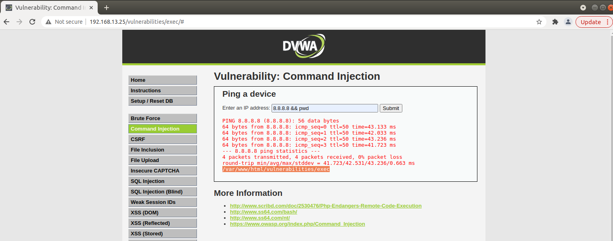
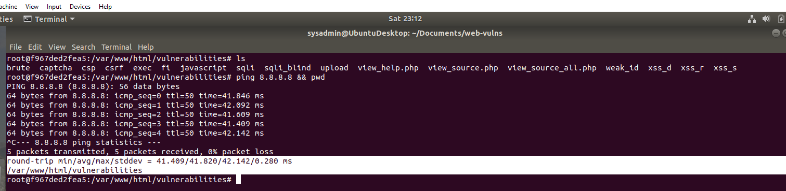

## Testing PING and PWD (Print Working Directory) Commands via the DVWA Website

## Testing PING and PWD (Print Working Directory) Commands via the Linux Command Line 

 

### <u>NOTE:</u>
* Both pictures show succesfull communication via PING and also show the Working Directory **/var/www/html/vulnerabilities**  

* the test was successful
