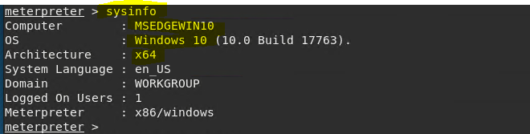

### Documenting sysinfo Command:

* Attackers will use sysinfo command to see the computer name, operating system and architecture or version of windows
* This gives the attacker information on ways to exploit the target
* for example there are specific payloads that can be used on Windows 10 with an archetecture x64

 

