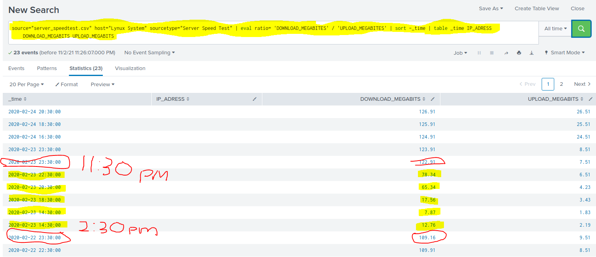
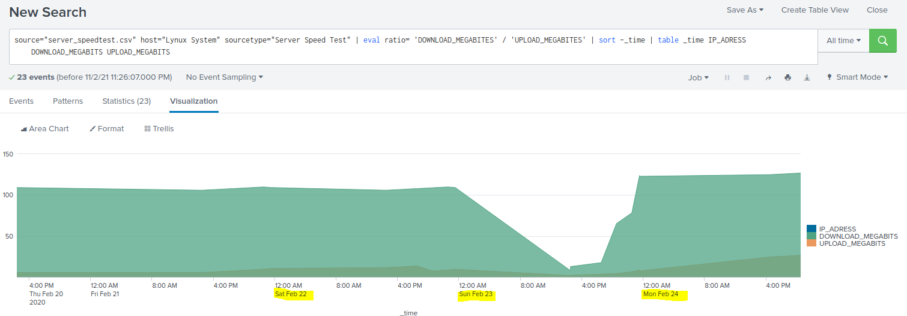

## Sorting the data by Time and IP Address

**Using the following Command:**

- source="server_speedtest.csv" host="server_speedtest.csv_host" sourcetype="csv" | eval ratio='DOWNLOAD_MEGABITS'/'UPLOAD_MEGABITS' | sort _time | table _time IP_ADDRESS UPLOAD_MEGABITS DOWNLOAD_MEGABITS 

NOTE: Search Report shows that on 02-23-2020 at 14:30 (2:30pm) the DOWNLOAD Speed decreased and did not return to normal operating speeds unitll 23:30 (11:30pm).

NOTE: Search Report indicates that the DOWNLOAD SPEED was down for approximately 8 hours. 

 

NOTE: The graph indicates that at 11:30pm on 02-22-2020 the DOWNLOAD SPEED began to decrease.

NOTE: The graph indicates that the DOWNLOAD SPEED returned to normal operating speed at 11:30pm on 02-23-2020

NOTE: According to the GRAPH, the disruption in DOWNLOAD SPEED lasted for approximately 12 hours

