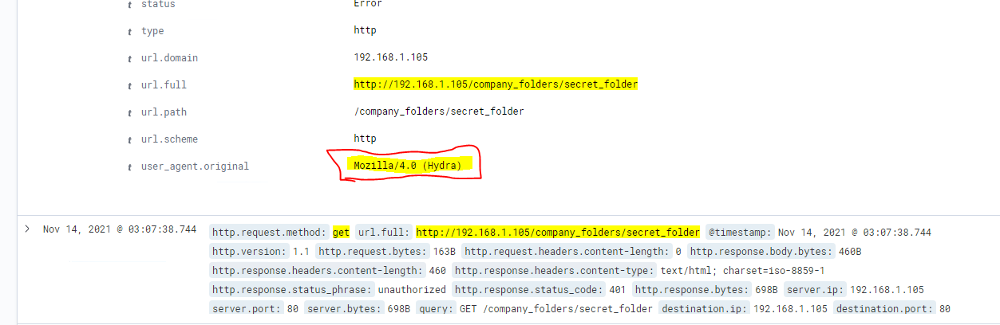
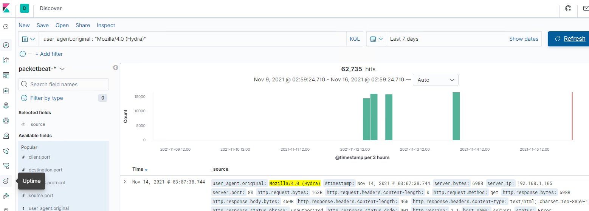
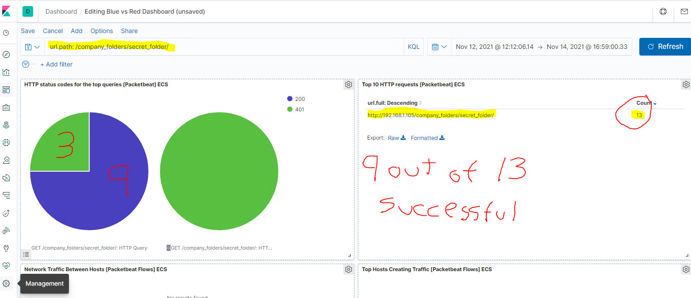

# BLUE TEAM Example 3

 High volume of "get" requests and URL "secret folder"

[pic](40.PNG) 

Example of user-agent: "Hydra"

 

Another example searching for HYDRA:

 

High volume of 401 errors and only THREE redirect. Very suspicious

 

Picture indicates that 9 our of 13 attempts to access the "secret file" were successful 

 

 

