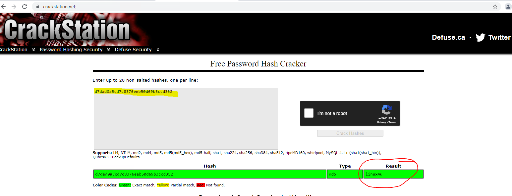
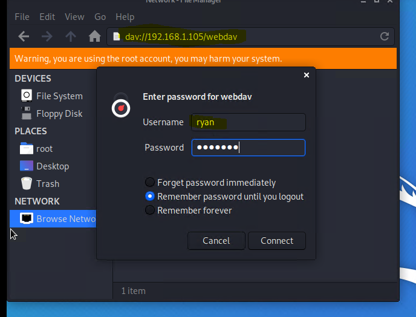
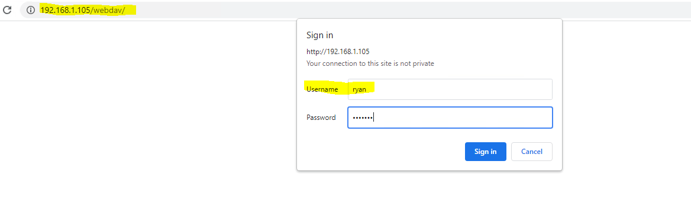

## Connect to WebDAV and Crack the HASH:

### There are several ways to break the password hash. Here, we simply used Crack Station, to avoid waiting for john to crack the password.

* NOTE that Ryan's password is: **linux4u**  

 

## Connect to the Summit Card Union Web Server via WebDAV

* The goal is to connect to the server (192.168.1.105) via WebDEV and establish a reverse shell 
* NOTE: Remember that you will be prompted to enter a User Name and Password.
* NOTE: Remember that we used CrackStation to get Ryans password (linux4u).
* NOTE: **Once you successfully enter Ryans credentials, you have succesfully created a remote access connection to the Summit Card Union Website: IP Address: 192.168.1.105** 

 

 

