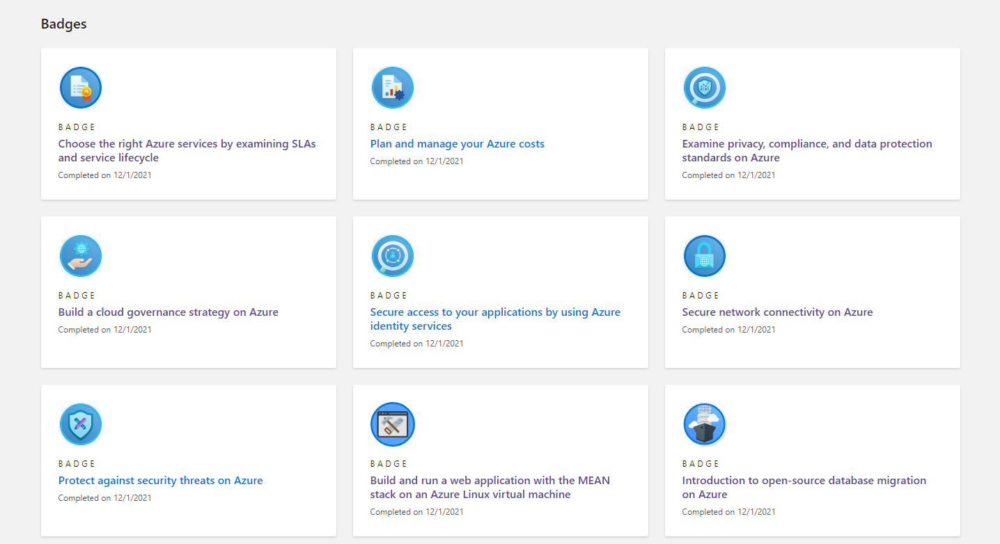
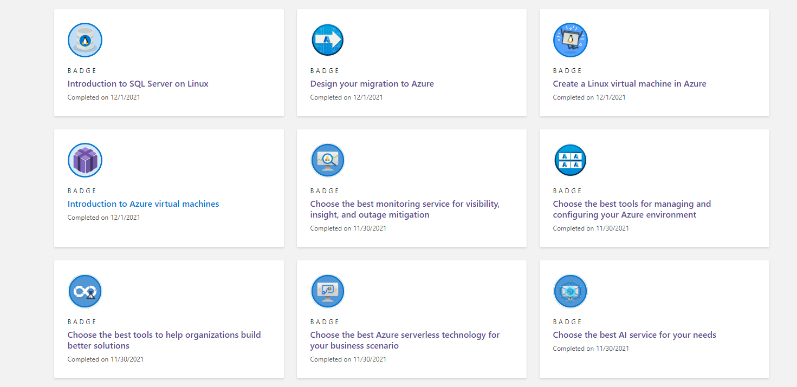
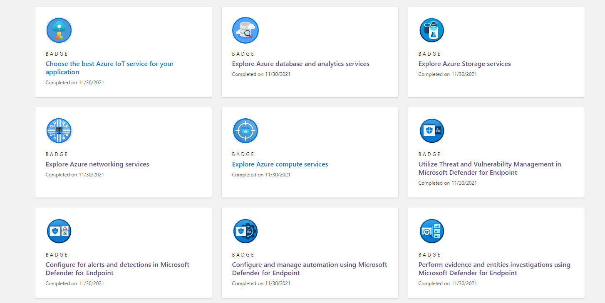
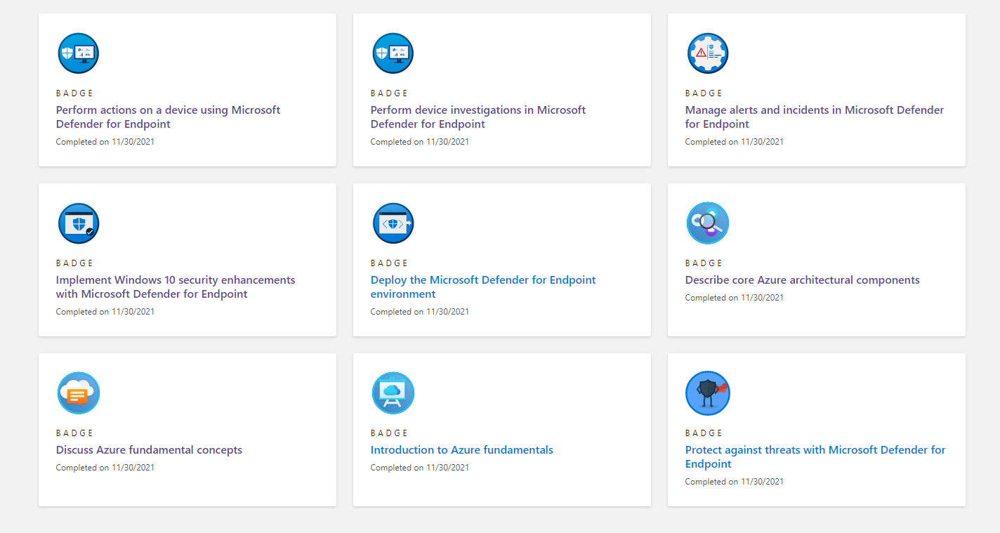
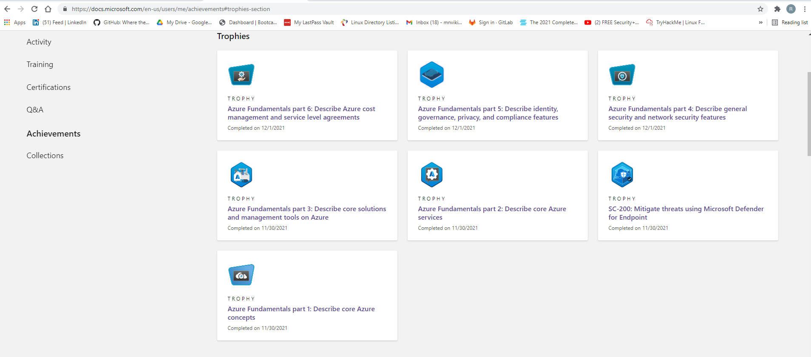

# Microsoft Azure Fundamentals

Azure Fundamentals certification is an opportunity to prove knowledge of cloud concepts, Azure services, Azure workloads, security and privacy in Azure, as well as Azure pricing and support. Candidates should be familiar with the general technology concepts, including concepts of networking, storage, compute, application support, and application development.

### Below is a list of Microsoft Azure Badges I have earned:

 

 

 

 
### Below are Microsoft Azure Trophies I have earned:

* I have successfully completed all SIX Azure Fundamentals trainings

 

