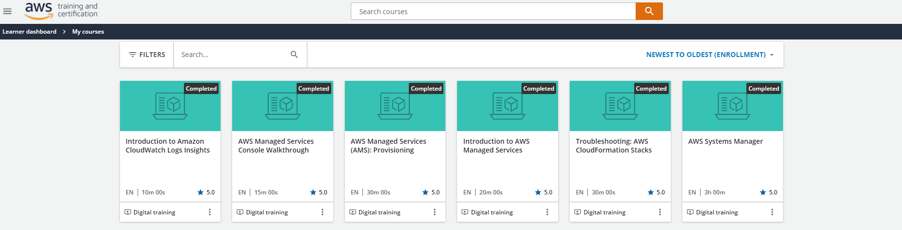
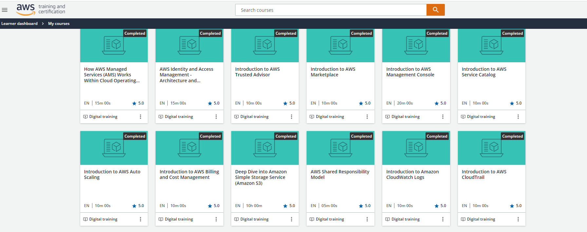
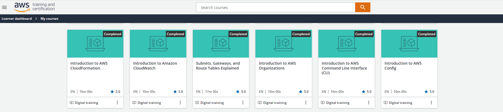
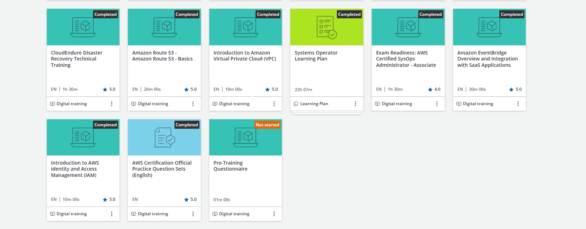
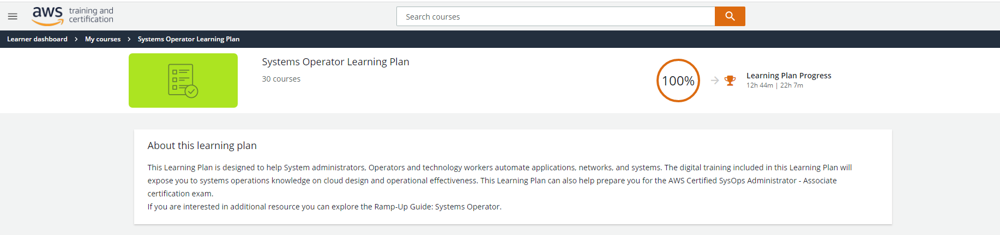

# AWS Security Fundamentals

### In-order to expand my knowledge of Cloud Security practices I have successfully completed the following AWS courses:

   

   

   

   

### The AWS Systems Operator is designed to help System administrators, Operators and technology workers automate applications, networks, and systems. The digital training included in this Learning Plan will expose you to systems operations knowledge on cloud design and operational effectiveness. This Learning Plan can also help prepare you for the **AWS Certified SysOps Administrator - Associate certification exam.** 

  

   

