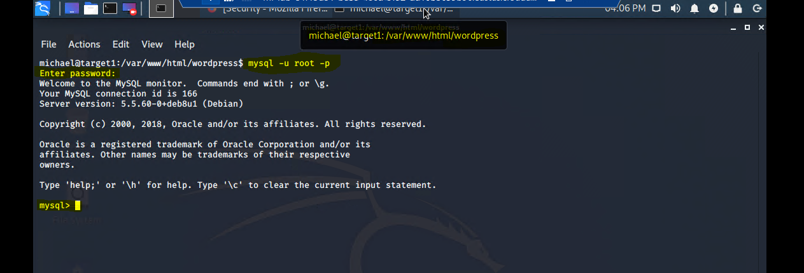
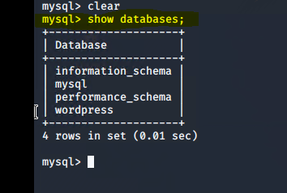
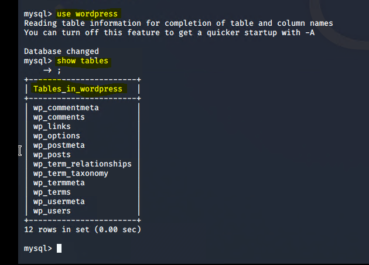
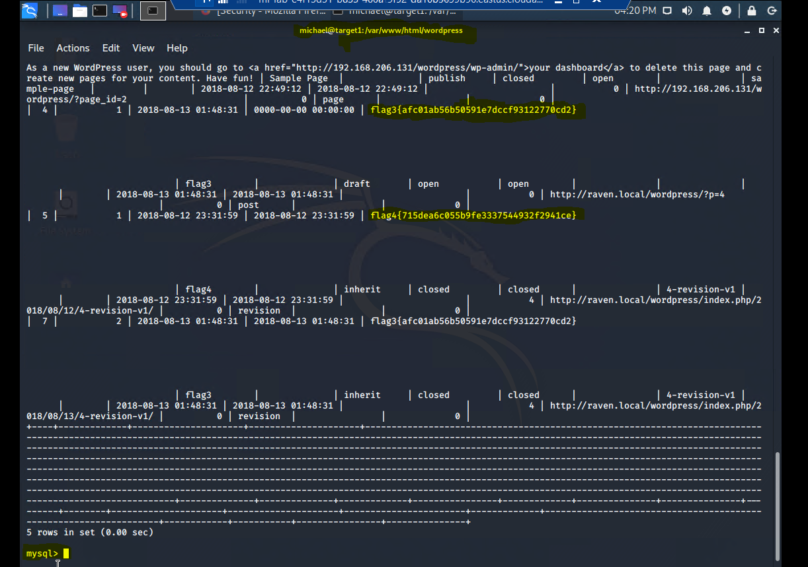

# Flag 3 Pictures

### Red Team navigated to /var/www/html/wordpress/wp-config.php and discovered the USERNAME and PASSWORD to the MySQL Database

* User Name: root
* Pass Word: R@v3nSecurity

 

### Red Team used the command: mysql -u root -p to gain access to the MySQL Database 

 

Command: Show databases;

### Red Team gained access to WordPress Database:

* Command: use wordpress
* Command: showtables;

### Red Team located Flags 3 and 4:

* command: select * from wp_posts;

 

