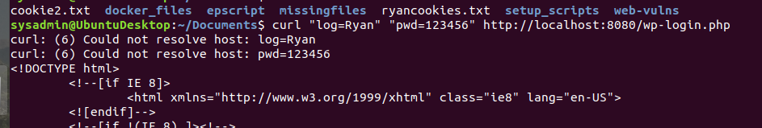
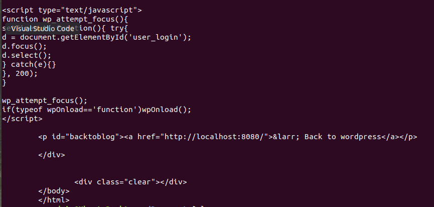

# <u> Rob Myers: Week 14 Homework: Web Development </u>

## <u> Overview </u>

In this homework, we will review the many of the concepts and tools covered in the Web Development unit. If needed, refer to the  reference sheets provided to you.

* [HTTP Reference Sheet](IMAGE/HTTP_Reference_Sheet.md)
* [Curl Reference Sheet](IMAGE/Curl_Reference_Sheet.md)

---

### <u> Answer the following questions about the HTTP request and response process. </u>

1. **What type of architecture does the HTTP request and response process occur in?**
    * The Client-Server model (OSI Layer 7: the application layer) is an exchange of information, a cycle of requests and responses between clients and servers.

    * HTTP is based on the client-server architecture model and a stateless request/response protocol that operates by exchanging messages across a reliable TCP/IP connection.


2. **What are the different parts of an HTTP request?** 


    **Request Line:** consists of three parts:

    * The HTTP Method 

    * The Request URI 
    
    * The HTTP Protocol 

    * For Example: Request-Line =  Method / Request-URI / HTTP-Version
 
    **Request Header:**

     * HTTP headers are the code that transfers data between a Web server 
     and a client. 
     * HTTP headers are mainly intended for the communication
     between the server and client in both directions.

    **Request Body:** 

     * HTTP Body Data is the data transmitted in an HTTP transaction message
     * It is used to send additional information to the server like a specific messege or username and password for example. 
     * It is typicaly an API in JSON format

3. **Which part of an HTTP request is optional?**

    * The Request Body is optional

<brk>

4. **What are the three parts of an HTTP response?**

    a. Status Line

    * **The status line** will typically contain an HTTP Status code like 200 OK

    <br>

    b. Response Header

     * **The Response Header** allows the server to pass additional information about the response which cannot be placed in the Status Line. These header fields give information about the server and about further access to the resource identified by the Request-URI.

     <br>

    c. Response Body 

    * **The Response Body** will display a messege regarding the request. One example might be if the web server could not find the requested webpage.

    <br>

5. **Which number class of status codes represents errors?**

    * The 400 family of status codes are client errors

    * The 500 family of status codes are server errors

6. **What are the two most common request methods that a security professional will encounter?**
 
    * The two most common request methods are **Get** and **Post**

    * **Get method** is when data is being requested from a server. Get requests should only retrieve data

    *  **Post method** the POST method requests that a web server accepts the data enclosed in the body of the request message

    | Advantages of GET | Advantages of POST |
    |-------------------|--------------------| 
    | The GET method retrieves Information by the URL request  |  POST method helps you to determine resource URI |
    |GET requests can be viewed in the browser history | POST requests do not remain in browser history |
    |You can easily use GET method to request required data | You can effortlessly transmit a large amount of data using post |

    
7. **Which type of HTTP request method is used for sending data?**

    * The Post Method is used to send data to a server

    * An example of the Post Method is when a user uploads a profile picture

8. **Which part of an HTTP request contains the data being sent to the server?**
    * The Request Body

<brk>   

9. **In which part of an HTTP response does the browser receive the web code to generate and style a web page?** 

    * The Response Body  

---

### <u> Answer the following questions about curl </u>

10. **What are the advantages of using curl over the browser?**

    * Curl is portable and compatible with all popular operating systems. 
    * Curl can work without user interaction and can be used in automation scripts. 
    * Curl can provide detailed logs of what was sent and received and is very good at debugging and logging errors.

<brk>

11. **Which curl option is used to change the request method?**

    * to change the method into something else by using the **-X** or **--request** command-line options followed by the actual method name.

    * For example: curl google.com -X DELETE 

    ### <u>[curl -X Delete](IMAGE/x.PNG)</u>
 
12. **Which curl option is used to set request headers?**

    * To set request headers us command line opton **-H** or **--header**

    * For Example: curl -H Host: google.com
 
    ### <u>[curl -H Host](IMAGE/host.PNG)</u>

13. **Which curl option is used to view the response header?**

    * To view curl response headers, we need to use curl **-I** or **--include**

    * For Example: curl -i google.com

    ### <u>[curl -i](IMAGE/-i.PNG)</u>

14. **Which request method might an attacker use to figure out which HTTP requests an HTTP server will accept?**

    * A hacker will use a GET Request to discover what HTTP Requests the server will accept
    * A hacker will also use the Options Method to determine what Options 
    are allowed on the server
    * Forexample: curl -X OPTIONS google.com -i 

    ### <u>[curl -x OPTIONS](IMAGE/1.PNG)</u> 

---

### <u> Answer the following questions about sessions and cookies: </u>

15. **Which response header sends a cookie to the client?**

    ```HTTP
    HTTP/1.1 200 OK
    Content-type: text/html
    Set-Cookie: cart=Bob
    ```
* <u>The HTTP header **Set-Cookie is a response header** and used to send cookies from the server to the client.</u> 

16. **Which request header will continue the client's session?**

    ```HTTP
    GET /cart HTTP/1.1
    Host: www.example.org
    Cookie: cart=Bob
    ```
* <u>The Cookie HTTP request header will continue the clients session.</u> 

---
  
### Look through the following example of an HTTP request and response and answer the following questions:

```HTTP 
POST /login.php HTTP/1.1
Host: example.com
Accept-Encoding: gzip, deflate, br
Connection: keep-alive
Content-Type: application/x-www-form-urlencoded
Content-Length: 34
Upgrade-Insecure-Requests: 1
User-Agent: Mozilla/5.0 (Linux; Android 6.0; Nexus 5 Build/MRA58N) AppleWebKit/537.36 (KHTML, like Gecko) Chrome/80.0.3987.132 Mobile Safari/537.36

username=Barbara&password=password
```

17. **What is the request method?**

    * POST

<brk>

18. **Which header expresses the client's preference for an encrypted response?**

    * Upgrade-Insecure-Requests
    * Upgrade Insecure Requests essentially means that any page resource being called from a non secure source (http) should be changed to a secure source (https). Even if the webpage itself is using “http” to make that request, using upgrade-insecure-requests will override that and the browser will call the resource using https.

<brk>

19. **Does the request have a user session associated with it?**

    * There has been NO HTTP response status code indicating that the request has been successfully completed. Therefore, **the answer is NO.**

20. **What kind of data is being sent from this request body?**

    * The data being sent is a USERNAME and PASSWORD
    * Sharing your USERNAME and PASSWORD is somthing that is highly dangerous behvaior and is not recomended

**HTTP Response**

```HTTP
HTTP/1.1 200 OK
Date: Mon, 16 Mar 2020 17:05:43 GMT
Last-Modified: Sat, 01 Feb 2020 00:00:00 GMT
Content-Encoding: gzip
Expires: Fri, 01 May 2020 00:00:00 GMT
Server: Apache
Set-Cookie: SessionID=5
Content-Type: text/html; charset=UTF-8
Strict-Transport-Security: max-age=31536000; includeSubDomains
X-Content-Type: NoSniff
X-Frame-Options: DENY
X-XSS-Protection: 1; mode=block

[page content]
```

21. What is the response status code?

    * 200 OK

22. What web server is handling this HTTP response?

    * Appache

23. Does this response have a user session associated to it?

    * Yes
    * Set-Cookie: SessionID=5

24. What kind of content is likely to be in the [page content] response body?

    * text/html

25. If your class covered security headers, what security request headers have been included?

* **Upgrade-Insecure-Requests: 1:** Tells the server to turn this HTTP connection into HTTPS, which will encrypt the response and all further communications.

* **HTTP Strict Transport Security (HSTS):** If a site is equipped with HTTPS, the server forces the browser to communicate over secure HTTPS. This way, the possibility of an HTTP connection is eliminated entirely.

* **Cross Site Scripting Protection (X-XSS):** X-XSS header protects against Cross-Site Scripting attacks

* **Content Security Policy (CSP):** Content Security Policy protects against Cross Site Scripting and other code injection attacks. 

* **X-Frame-Options:** X-Frame Options help protect against Spoofing attacks

* **X-Content-Type-Options:** The X-Content-Type header offers a countermeasure against MIME sniffing.

* **Connection: keep-alive:** Tells the server to keep open the TCP connection used for this HTTP transfer after sending the response.

### Monoliths and Microservices

<u>Answer the following questions about monoliths and microservices:</u>

26. What are the individual components of microservices called?

* **Services:** The term illustrates the method of breaking down an application into generally small, self-contained services, written in any language, that communicate over lightweight protocols. 

 

27. What is a service that writes to a database and communicates to other services?

* **API:** Application Programing interface
* API allows Applications and/or Websites to communicate with eachother 

28. What type of underlying technology allows for microservices to become scalable and have redundancy?

* Cointainers allow microservices to be scalable and redundant 

## Deploying and Testing a Container Set

### <u> Answer the following questions about multi-container deployment: </u>

29. What tool can be used to deploy multiple containers at once?

    * **Docker-Compose:** Docker-Compose is a tool for defining and running multi-container Docker applications. With Compose, you use a YAML file to configure your application’s services. Then, with a single command, you create and start all the services from your configuration. 

    * Example to start your containers: <u>Docker-Compose up -d</u>

30. What kind of file format is required for us to deploy a container set?

    * A YML FIle is what is required for us to deploy a container set

### Databases

31. Which type of SQL query would we use to see all of the information within a table called `customers`?

* SELECT * FROM customers WHERE ID= '1' or '1' = "1"

32. Which type of SQL query would we use to enter new data into a table? (You don't need a full query, just the first part of the statement.)

    * INSERT INTO

    <u> EXAMPLE: </u> 

     

33. Why would we never run `DELETE FROM <table-name>;` by itself?

    * It deletes the entire table since it does not have the where clause

---

## Bonus Challenge Overview: Logging In and Saving Cookies with Curl

## Step 1: Set Up

### <u> Create two new users: Amanda and Ryan. </u>   

<br>  

 

### Step 2: Baselining

1. Using your browser, log into your WordPress site as your sysadmin account and navigate to `localhost:8080/wp-admin/users.php`, where we previously created the user Ryan. Examine this page briefly. Log out.

**NOTE:  Look at the view of the user screen when signed in as sysadmin**
 

2. Using your browser, log into your Ryan account and attempt to navigate to `localhost:8080/wp-admin/index.php`. Note the wording on your Dashboard.

**NOTE:  Look at the view of the user screen when signed in as Ryan**
 

3. Attempt to navigate to `localhost:8080/wp-admin/users.php`. Note what you see now.


### Step 3: Using Forms and a Cookie Jar

1. Construct a `curl` request that enters two forms: `"log={username}"` and `"pwd={password}"` and goes to `http://localhost:8080/wp-login.php`. Enter Ryan's credentials where there are placeholders.

    * curl "log=Ryan" "pwd=123456" http://localhost:8080/wp-login.php

    

<u> **Question:** Did you see any obvious confirmation of a login? (Y/N)</u>

   *  No , however the command did run and there is a HTTP Code 200
   *  It also made changes to ryancookies.txt

 

**<u>Link to the code confirmation from command line after running the above curl command</u>** 

[Curl_Command](IMAGE/RYAN.md)  

2. Construct the same `curl` request, but this time add the option and path to save your cookie: `--cookie-jar ./ryancookies.txt`. This option tells `curl` to save the cookies to the `ryancookies.txt` text file.

    * curl --cookie-jar ./ryancookies.txt "log=Ryan" "pwd=123456" http://localhost:8080/wp-login.php

 

**<u>Link to the code confirmation from command line after running the above curl command</u>** 

[Saving the cookie](IMAGE/ryan-2.md)  

3. Read the contents of the `ryancookies.txt` file.

<u> **Question:** How many items exist in this file? </u>

* There are 3 items that exist. **See picture in link below** 

[ryancookies.txt](IMAGE/ryan9.PNG) 

## Step 4: Log in Using Cookies

1. Craft a new `curl` command that now uses the `--cookie` option, followed by the path to your cookies file. For the URL, use `http://localhost:8080/wp-admin/index.php`.

    * curl --cookie ryancookies.txt http://localhost:8080/wp-admin/index.php

 

**<u>Link to the code confirmation from command line after running the above curl command</u>** 

[--cookie code](IMAGE/cookiecode.md)  

<u> **Question:** Is it obvious that we can access the Dashboard? (Y/N) </u>

* No, however after the command finished running it is easy to see that the command did run the script in ryanscookies.txt

2. Press the up arrow on your keyboard to run the same command, but this time, pipe `| grep Dashboard` to the end of your command to return all instances of the word `Dashboard` on the page.

    * curl --cookie ryancookies.txt http://localhost:8080/wp-admin/index.php | grep Dashboard

 

<u> **Question:**  Look through the output where `Dashboard` is highlighted. Does any of the wording on this page seem familiar? (Y/N) 

* Yes
* The data presented after running the above curl command appears on the actual website when you click on the **HELP button**.
* Therefore you can see that you are successfully logged in to Ryan's Editor privlege's dashboard

 

 


### Step 5: Test the Users.php Page

1. Finally, write a `curl` command using the same `--cookie ryancookies.txt` option, but attempt to access `http://localhost:8080/wp-admin/users.php`.

    * curl --cookie ./ryancookies.txt http://localhost:8080/wp-admin/users.php

<u> **Question:** What happens this time? </u> 

* I am not able to log in with sysadmin privleges
* IT brings up the "error-Page" stating I am not able to browse users

 


