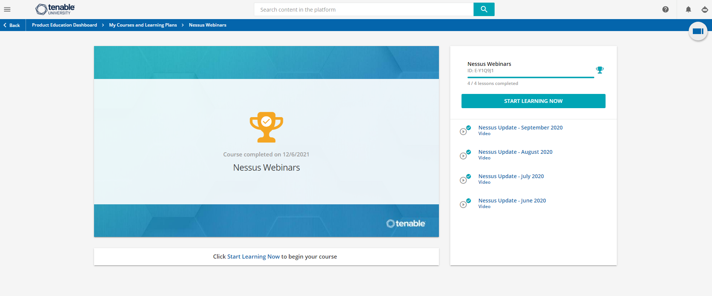

# Nessus Certification 

Nessus is the most commonly-deployed vulnerability assessment solution across the industry. This solution helps you perform high-speed asset discovery, target profiling, configuration auditing, malware detection, sensitive data discovery and so much more. Nessus Professional runs on client devices such as laptops and can be effectively used by your security departments within your organization.

 

