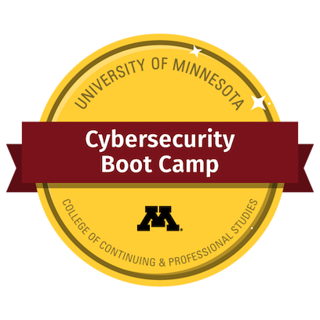

# University-of-Minnesota-Cyber Security Bootcamp

I had the opportunity to attend the University of Minnesota Cybersecurity Boot Camp where I learned hands-on training in Networking, Systems like Linux and Windows, Web, Databases (ELK Stack), as well as Defensive and Offensive Cybersecurity practices. 

I have also completed the CompTIA Security + Certification and have learned many Cyber Security Industry Standard practices to include the following: Packet Analysis, Attacks, Threats, and Vulnerabilities, Cryptography, Architecture and Design, Implementation, Operations and Incident Response, and last, Governance, Risk, and Compliance 

Please review the information below to learn more about all the skills and experience I have learned through my education at the University of Minnesota.
 
## Networking:

    - Packet Analysis
        - Splunk
        - Wireshark
        - Kibana
        - Security Onion
        - Nessus
        - SNORT 
        - SEIM/IDPS

    - Azure Virtual Machines
        - Windows OS
        - Linux OS
        - Firewalls
        - Permissions
        - Security Rules
            - Security Alerts and Alarms
        - Penetration Testing (Red vs Blue)

## Systems:

    - Windows and Linux Administration Techniques
    - Windows and Linux Hardening

## Cybersecurity:

    - Secure Network Design and Architecture
    - Risk Management
    - Cryptography
    - Vulnerability Assessment
        - Red and Blue Teams 
    - Identity and Access Management
    - Cloud Security
        - AWS, IaaS, PaaS, SaaS
    - Ethical Hacking and Penetration:
        - Metasploit
        - SSH commands
        - Common Injections and other "hacking" techniques  
    - Digital Forensics 
        - Autopsy and Cell Phone Forensics 
    - Web Vulnerabilities and Security 
        - Firewalls, and other rules/policies
        - Web content filtering

## Programming and Scripting:

    - Bash Scripting
    - PowerShell Scripting
    - HTML/CSS/Java
    

