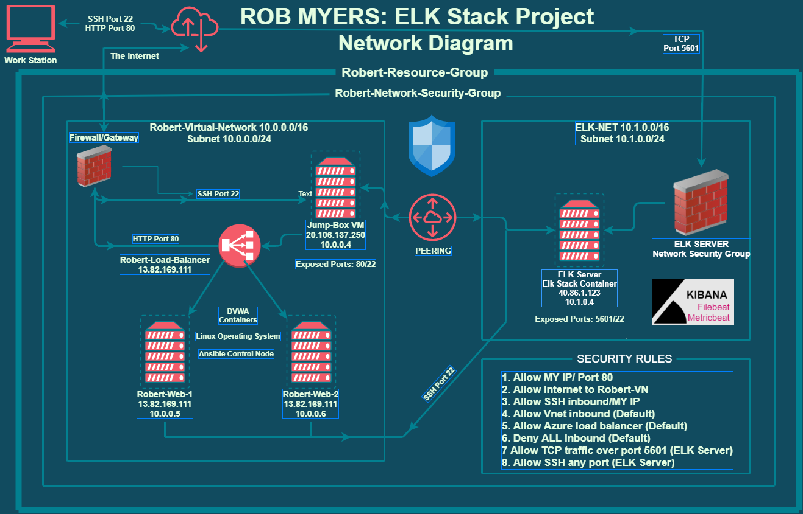
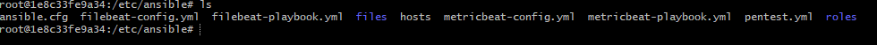

## Rob Myers ELK Stack Project:
 **October 6th, 2021 -- University of Minnesota - Cybersecurity Boot Camp**

## Automated ELK Stack Deployment

The files in this repository were used to configure the network depicted below.

   

    
  <brk>

### These files have been tested and used to generate a live ELK deployment on Azure. They can be used to recreate the entire deployment pictured above or select portions of the **yaml** file's may be used to install only certain pieces of it. Below are links to the files: 

  - **Ansible** 

    * [Ansible.cfg File](Ansible/ansible.yml)
      *  /ETC/Ansible 

    
   
  - **Hosts File**
    * [Hosts File](Ansible/hosts.yml) 

  - **ELK-Configuration** 

    * [ELK-Playbook](Ansible/install-elk.yml)

  - **Filebeat**

    * [Filebeat Configuration](FileBeat/filebeat-config.yml)
    * [Filebeat Playbook](FileBeat/filebeat-playbook.yml)

  - **MetricBeat**

    * [MetricBeat Configuration](MetricBeat/metricbeat-config.yml)
    * [MetricBeat Playbook](MetricBeat/metricbeat-playbook.yml)

## This document/project contains the following details:
- Description of the Topologu
- Access Policies
- ELK Configuration
  - Beats in Use
  - Machines Being Monitored
- How to Use the Ansible Build

### Description of the Topology

The main purpose of this network is to expose a load-balanced and monitored instance of DVWA, the D*mn Vulnerable Web Application.

Load balancing ensures that the application will be highly **efficient and flexible**, in addition to restricting **traffic** to the network.

- What aspect of security do load balancers protect? 
  * Load balaners help protect the network against hackers and attacks like DDoS attacks. 
  * They allow for daily rule updates and help protect against unauthorized access.   
  * They also also reduce the load inorder to achive optimal traffic speed.
  * Load balencers are also helpfull at accomodating failed or under performing servers/componenents to maintain user service.
  
<brk>

- What is the advantage of a jump box?

  * A Jump Box Provisioner is also important as it prevents Azure VMs from being exposed via a public IP Address. This allows us to do monitoring and logging on a single box. 
  * The main benefits of JumpBox are its extensive software library, automated backups, and customizations.

Integrating an ELK server allows users to easily monitor the vulnerable VMs for changes to the  **network** and system **logs**.

- What does Filebeat watch for?

  * Filebeat is a lightweight shipper for forwarding and centralizing log data.
  * Filebeat watches and monitors the log files, user specific locations, collects log events and forwards them either to Elasticsearch or Logstash for indexing. 

- What does Metricbeat record?

  * Metricbeat is a lightweight shipper that records and periodically collects metrics from the operating system.
  * It also takes metrics and statistics from services running on the server and takes the data collected and ships them to the output that users specify, such as Elasticsearch or Logstash.

The configuration details of each machine may be found below.
_Note: Use the [Markdown Table Generator](http://www.tablesgenerator.com/markdown_tables) to add/remove values from the table_.

| Name     | Function | IP Address | Operating System |
|----------|----------|------------|------------------|
| Jump Box | Gateway  | 10.0.0.1   | Linux            |
| ELK VM   | ELK Stack |  10.0.0.4 | Linux            |
| Robert-WEB-1    | DVWA Server| 10.0.0.5|Linux       |
| Robert-WEB-2    | DVWA Server| 10.0.0.6| Linux      |

### Access Policies

The machines on the internal network are not exposed to the public Internet. 

Only the **Jump-Box-Provisioner** machine can accept connections from the Internet. Access to this machine is only allowed from the following IP addresses:
- My Home/Personal IP Address listed in INCOMING RULES/NETWORKING SECURITY GROUPS
- also can only be accesed using SSH
 
Machines within the network can only be accessed by **Jump-Box-Provisioner 10.0.0.4**.

- Which machine did you allow to access your ELK VM AND what was its IP Address? 
    * Jump-Box VM: 10.0.0.4 via port 22 (SSH)
    * MyHOME/Personal IP Address: Port 5601 (TCP)

A summary of the access policies in place can be found in the table below.

| Name     | Publicly Accessible | Allowed IP Addresses |
|----------|---------------------|----------------------|
| Jump Box | Yes              |     MY Home/Personal IP |
| ELK VM   | Yes              |     MY Home/Personal IP |
| Robert-WEB-1    | No               |     10.0.0.6            |
| Robert-WEB-2    | No               |     10.0.0.7            |  

### Elk Configuration

Ansible was used to automate configuration of the ELK machine. No configuration was performed manually, which is advantageous because...
- _TODO: What is the main advantage of automating configuration with Ansible?_

The playbook implements the following tasks:
- _TODO: In 3-5 bullets, explain the steps of the ELK installation play. E.g., install Docker; download image; etc._
- ...
- ...

The following screenshot displays the result of running `docker ps` after successfully configuring the ELK instance.

### Target Machines & Beats
This ELK server is configured to monitor the following machines:
- _TODO: List the IP addresses of the machines you are monitoring_

We have installed the following Beats on these machines:
- _TODO: Specify which Beats you successfully installed_

These Beats allow us to collect the following information from each machine:
- _TODO: In 1-2 sentences, explain what kind of data each beat collects, and provide 1 example of what you expect to see. E.g., `Winlogbeat` collects Windows logs, which we use to track user logon events, etc._

### Using the Playbook
In order to use the playbook, you will need to have an Ansible control node already configured. Assuming you have such a control node provisioned: 

SSH into the control node and follow the steps below:
- Copy the _____ file to _____.
- Update the _____ file to include...
- Run the playbook, and navigate to ____ to check that the installation worked as expected.

_TODO: Answer the following questions to fill in the blanks:_
- _Which file is the playbook? Where do you copy it?_
- _Which file do you update to make Ansible run the playbook on a specific machine? How do I specify which machine to install the ELK server on versus which to install Filebeat on?_
- _Which URL do you navigate to in order to check that the ELK server is running?

_As a **Bonus**, provide the specific commands the user will need to run to download the playbook, update the files, etc._