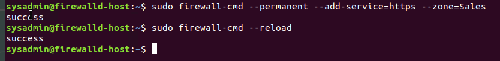

# Rob Myers: Week 11 Homework
## Network Security Homework 

### Security Control Types

The concept of defense in depth can be broken down into three different security control types. Identify the security control type of each set  of defense tactics.

1. Walls, bollards, fences, guard dogs, cameras, and lighting are what type of security control?

    - Answer: PHYSICAL

2. Security awareness programs, BYOD policies, and ethical hiring practices are what type of security control?

    - Answer: ADMINISTRATIVE

3. Encryption, biometric fingerprint readers, firewalls, endpoint security, and intrusion detection systems are what type of security control?

    - Answer: TECHNICAL 

### Intrusion Detection and Attack indicators

1. What's the difference between an IDS and an IPS?

    

    * IDS and IPS Technology is critical because they cover Automation, Complience, and Policy Enforcement

<brk>

2. What's the difference between an Indicator of Attack and an Indicator of Compromise?

    

### The Cyber Kill Chain

Name each of the seven stages for the Cyber Kill chain and provide a brief example of each.

1. Reconnaissance: Information gathering stage against targeted victim. Information sources include, DNS registration websites, LinkedIn, Facebook, Twitter, etc.

2. Weaponization: After collecting information regarding infrastructure and employees, adversaries have the capability to establish attack vectors and technical profiles of targets such as: logical and administrative security controls, infil/exfil points, etc.

3. Delivery: The delivering of the weaponized payload, via email, website, USB, etc.

4. Exploitation: Actively compromise adversary’s applications and servers while averting the physical, logical, and administrative controls. Exploiting employees through social engineering. This stage prepares for escalation during the installation phase.

5. Installation: a.k.a, the persistence preparation phase. Activities include, malicious software installation, backdoor implants, persistence mechanism (cron jobs), AutoRun keys, services, log file deletion, and timestamp manipulation.

6. Command & Control (C2): A command channel, most typically Internet Relay Chat (IRC), used for remote control of a victim’s computer.

7. Actions on Objectives: After achieving the equivalent of “Hands on Keyboard” access to a victim’s systems, adversaries are now able to act their objectives.

    

### Snort Rule Analysis

A snort rule is composed of two parts: the header and its options. The header matches packets and the options serve to filter and perform actions on those matches.

    
Use the Snort rule to answer the following questions:

1. Break down the Snort Rule header and explain what is happening.
### Snort Header example: 
alert tcp $EXTERNAL_NET any -> $HOME_NET 5800:5820 (msg:"ET SCAN Potential VNC Scan 5800-5820"; flags:S,12; threshold: type both, track by_src, count 5, seconds 60; reference:url,doc.emergingthreats.net/2002910; classtype:attempted-recon; sid:2002910; rev:5; metadata:created_at 2010_07_30, updated_at 2010_07_30;)

<brk>                       
  
- Rule Action: alert
- Protocol: tcp (Transport Layer OSI Model Layer 4)
- Source IP: $EXTERNAL_NET (external network)
- Source Port: any 
- Direction: ->
- Destination IP: $HOME_NET (local network) 
- Destination Port:5800:5820 

This rule logs the message “ET SCAN Potential VNC Scan 5800-5820” when it detects TCP packet coming from the external network on any ports going into the local network on ports 5800 to 5820

2. What stage of the Cyber Kill Chain does this alert violate?

    * This alert is violating stage 4: Exploitation

3. What kind of attack is indicated?

    * Indicator of Attack (IOA) 

Snort Rule #2
### Snort Header example:

alert tcp $EXTERNAL_NET $HTTP_PORTS -> $HOME_NET any (msg:"ET POLICY PE EXE or DLL Windows file download HTTP"; flow:established,to_client; flowbits:isnotset,ET.http.binary; flowbits:isnotset,ET.INFO.WindowsUpdate; file_data; content:"MZ"; within:2; byte_jump:4,58,relative,little; content:"PE|00 00|"; distance:-64; within:4; flowbits:set,ET.http.binary; metadata: former_category POLICY; reference:url,doc.emergingthreats.net/bin/view/Main/2018959; classtype:policy-violation; sid:2018959; rev:4; metadata:created_at 2014_08_19, updated_at 2017_02_01;)

1. Break down the Sort Rule header and explain what is happening.

    - Rule Action: alert
    - Protocol: tcp (Transport Layer OSI Model Layer 4)
    - Source IP: $EXTERNAL_NET (external network)
    - Source Port: $HTTP_PORTS (Port 80) 
    - Direction: ->
    - Destination IP: $HOME_NET (local network) 
    - Destination Port:any 

2. What layer of the Defense in Depth model does this alert violate?

    * This alert is violating stage 5: Instalation

3. What kind of attack is indicated?

    * Indicator of Compromise (IOP)

Snort Rule #3

Write a Snort rule that alerts when traffic is detected inbound on port 4444 to the local network on any port. Be sure to include the `msg` in the Rule Option.

- alert tcp $EXTERNAL_NET 4444 -> $HOME_NET any (msg:”Traffic detected from port 4444”)

## Part 2: "Drop Zone" Lab

#### Uninstall "Uncomplicated Firewall" (UFW)

- Run the command that removes any running instance of `ufw`.

    * sudo apt -y remove ufw

    

#### Enable and start Firewalld

By default, these service should be running. If not, then run the following commands:

- Run the commands that enable and start `firewalld` upon boots and reboots.

    * sudo systemctl enable firewalld
    * sudo systemctl start firewalld
    
 Note: This will ensure that `firewalld` remains active after each reboot.

#### Confirm that the service is running.

- Run the command that checks whether or not the `firewalld` service is up and running.

    * sudo firewall-cmd --state

#### List all firewall rules currently configured.

- Run the command that lists all currently configured firewall rules:

    * sudo firewall-cmd --list-all
     

- Take note of what Zones and settings are configured. You many need to remove unneeded services and settings.

#### List all supported service types that can be enabled.

- Run the command that lists all currently supported services to see if the service you need is available

    * sudo firewall-cmd --get-services

#### Zone Views

- Run the command that lists all currently configured zones.

    * firewall-cmd --list-all-zones

#### Create Zones for `Web`, `Sales` and `Mail`.

- Run the commands that creates Web, Sales and Mail zones.

    * sudo firewall-cmd --new-zone=Web --permanent
    * sudo firewall-cmd --new-zone=Sales --permanent
    * sudo firewall-cmd --new-zone=Mail --permanent

 

 NOTE: dont forget to run sudo firewall-cmd --reload to ensure all changes have been updated

#### Set the zones to their designated interfaces:

- Run the commands that sets your `eth` interfaces to your zones.

    * sudo firewall-cmd --zone=Public --change-interface=eth0
    * sudo firewall-cmd --zone=Web --change-interface=eth1
    * sudo firewall-cmd --zone=Sales --change-interface=eth2
    * sudo firewall-cmd --zone=Mail --change-interface=eth3

 

NOTE: dont forget to run sudo firewall-cmd --reload to ensure all changes have been updated
    
- Run the commands that add services to the **public**, **web**, **sales**, and the **mail** zone.

- Public Zone:

    * sudo firewall-cmd --permanent --add-service=http --zone=
    public
    * sudo firewall-cmd --permanent --add-service=https --zone=
    public
    * sudo firewall-cmd --permanent --add-service=pop3 --zone=
    public
    * sudo firewall-cmd --permanent --add-service=smtp --zone=
    public

 <brk> 
     
 

- Web Zone:

    * sudo firewall-cmd --permanent --add-service=http --zone=Web
    

- Sales Zone:

    * sudo firewall-cmd --permanent --add-service=https --zone=Sales

- Mail Zone:

    * sudo firewall-cmd --permanent --add-service=smpt --zone=
    Mail
    * sudo firewall-cmd --permanent --add-service=pop3 --zone=
    Mail

- What is the status of `http`, `https`, `smtp` and `pop3`?

    - To check the staus of HTTP, HTTPS, SMTP, and POP3, use command:

    * sudo firewall-cmd --list-all

#### Add your adversaries to the Drop Zone.

- Run the command that will add all current and any future blacklisted IPs to the Drop Zone.

Add the following to the Drop Zone:

    - sudo firewall-cmd --permanent --zone=drop --add-source=

    * 10.208.56.23
    * 135.95.103.76
    * 76.34.169.118

 

Picture of all IP address's added to the drop zone:

  

#### Make rules permanent then reload them:

- Run the command that reloads the `firewalld` configurations and writes it to memory

    * sudo firewall-cmd --reload

#### View active Zones

Now, we'll want to provide truncated listings of all currently **active** zones. This a good time to verify your zone settings.

- Run the command that displays all zone services.

    * sudo firewall-cmd --list-all-zones

#### Block an IP address

- Use a rich-rule that blocks the IP address `138.138.0.3`.

    * sudo firewall-cmd --permanent --add-rich-rule="rule family='ipv4' source address='138.138.0.3' reject"

 

Picture of all rich rules: 

   

#### Block Ping/ICMP Requests

Harden your network against `ping` scans by blocking `icmp ehco` replies.

- Run the command that blocks `pings` and `icmp` requests in your `public` zone.

    * sudo firewall-cmd --zone=public --add-icmp-block={echo-request,echo-reply} 

 

Picture of icmp-blocks:

  

#### Rule Check

- Run the command that lists all of the rule settings. Do one command at a time for each zone.

* sudo firewall-cmd --list-all --zone=public
* sudo firewall-cmd --list-all --zone=Mail
* sudo firewall-cmd --list-all --zone=Sales
* sudo firewall-cmd --list-all --zone=Web
* sudo firewall-cmd --list-all --zone=drop
* sudo firewall-cmd --list-all --zone=block
* sudo firewall-cmd --list-all --zone=dmz
* sudo firewall-cmd --list-all --zone=external
* sudo firewall-cmd --list-all --zone=home
* sudo firewall-cmd --list-all --zone=internal
* sudo firewall-cmd --list-all --zone=trusted
* sudo firewall-cmd --list-all --zone=work

### Part 3: IDS, IPS, DiD and Firewalls

Now, we will work on another lab. Before you start, complete the following review questions.

#### IDS vs. IPS Systems

1. Name and define two ways an IDS connects to a network.

   Answer 1: IDS must connect to a port that can see all traffic between the LAN and the Internet

   Answer 2: IDS must be connected to a mirroe switch port or a hub located between the Internet connection and the LAN

2. Describe how an IPS connects to a network.

   Answer: It will be connected to the network as any other piece of hardware. The difference is that IPS should be positioned where it will see the bare minimum of traffic it needs to monitor traffic inorder to keep performance issues under control.

3. What type of IDS compares patterns of traffic to predefined signatures and is unable to detect Zero-Day attacks?

   Answer: Signature-based intrusion detection system (SIDS)

4. Which type of IDS is beneficial for detecting all suspicious traffic that deviates from the well-known baseline and is excellent at detecting when an attacker probes or sweeps a network?

   Answer: Statistical anomaly-based detection

#### Defense in Depth

1. For each of the following scenarios, provide the layer of Defense in Depth that applies:

    1.  A criminal hacker tailgates an employee through an exterior door into a secured facility, explaining that they forgot their badge at home.

        Answer: Physical

    2. A zero-day goes undetected by antivirus software.

        Answer: Technical

    3. A criminal successfully gains access to HR’s database.

        Answer: Technical

    4. A criminal hacker exploits a vulnerability within an operating system.

        Answer: Technical

    5. A hacktivist organization successfully performs a DDoS attack, taking down a government website.

        Answer: Technical

    6. Data is classified at the wrong classification level.

        Answer: Administrative

    7. A state sponsored hacker group successfully firewalked an organization to produce a list of active services on an email server.

        Answer: Technical

2. Name one method of protecting data-at-rest from being readable on hard drive.

    Answer: Encrypting hard drives is one of the best ways to ensure the security of data at rest.

3. Name one method to protect data-in-transit.

    Answer: Encryption

4. What technology could provide law enforcement with the ability to track and recover a stolen laptop.

   Answer: Security/Tracking software like Hidden, Prey and LoJack for example

5. How could you prevent an attacker from booting a stolen laptop using an external hard drive?

    Answer: Two potential ways to prevent an attacker booting a stolen laptop using an external hard drive would be to encrypt the hard drive and dissable ports/ability to access the hard drive externaly through USB or other methods

#### Firewall Architectures and Methodologies

1. Which type of firewall verifies the three-way TCP handshake? TCP handshake checks are designed to ensure that session packets are from legitimate sources.

  Answer: Firewalls that perform Network Layer Inspections

2. Which type of firewall considers the connection as a whole? Meaning, instead of looking at only individual packets, these firewalls look at whole streams of packets at one time.

  Answer: Firewalls that allow UDP

3. Which type of firewall intercepts all traffic prior to being forwarded to its final destination. In a sense, these firewalls act on behalf of the recipient by ensuring the traffic is safe prior to forwarding it?

  Answer: Intrusion Prevention Systems (IPS) 

4. Which type of firewall examines data within a packet as it progresses through a network interface by examining source and destination IP address, port number, and packet type- all without opening the packet to inspect its contents?

  Answer: Intrusion Detection Systems (IDS)

5. Which type of firewall filters based solely on source and destination MAC address?

  Answer: Access List

### Bonus Lab: "Green Eggs & SPAM"
In this activity, you will target spam, uncover its whereabouts, and attempt to discover the intent of the attacker.
 
- You will assume the role of a Jr. Security administrator working for the Department of Technology for the State of California.
 
- As a junior administrator, your primary role is to perform the initial triage of alert data: the initial investigation and analysis followed by an escalation of high priority alerts to senior incident handlers for further review.
 
- You will work as part of a Computer and Incident Response Team (CIRT), responsible for compiling **Threat Intelligence** as part of your incident report.

#### Threat Intelligence Card

**Note**: Log into the Security Onion VM and use the following **Indicator of Attack** to complete this portion of the homework. 

Locate the following Indicator of Attack in Sguil based off of the following:

- **Source IP/Port**: `188.124.9.56:80`
- **Destination Address/Port**: `192.168.3.35:1035`
- **Event Message**: `ET TROJAN JS/Nemucod.M.gen downloading EXE payload`

Answer the following:

1. What was the indicator of an attack?
   - Hint: What do the details of the reveal? 

    Answer: 

2. What was the adversarial motivation (purpose of attack)?

    Answer: 

3. Describe observations and indicators that may be related to the perpetrators of the intrusion. Categorize your insights according to the appropriate stage of the cyber kill chain, as structured in the following table.

| TTP | Example | Findings |
| --- | --- | --- | 
| **Reconnaissance** |  How did they attacker locate the victim? | 
| **Weaponization** |  What was it that was downloaded?|
| **Delivery** |    How was it downloaded?|
| **Exploitation** |  What does the exploit do?|
| **Installation** | How is the exploit installed?|
| **Command & Control (C2)** | How does the attacker gain control of the remote machine?|
| **Actions on Objectives** | What does the software that the attacker sent do to complete it's tasks?|

    Answer: 

4. What are your recommended mitigation strategies?

    Answer: 

5. List your third-party references.

    Answer: 