# Rob Myers: Week 10 Homework
## Cryptography

Topics Covered in Your Assignments

    * Encryption
    * Decryption
    * Caesar Cipher
    * Encoding and Decoding
    * Binary
    * Symmetric and Asymmetric Encryption
    * Open SSL
    * Key/IV
    * Public/Private Keys
    * Key Distribution
    * Hashing
    * Hashing Algorithms
    * Hashcat
    * Steganography
    * Steghide

    Homework scenario is doctor at Nakatomi Hospital opened up an email containing ransomware.
    The Ransomeware has given two options:
            * Pay 100 Bitcoins
            * Solve 6 Riddles

Objective is to solve the 6 riddles and recieve key codes inorder to get access back to the network

# Scenario 1: 

    * Decode the following: OZCJMZ
    * Decoded Messege = Gruber
    * Answer Key: 6skd8s

 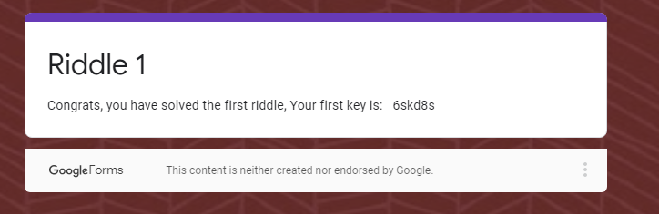

 # Scenario 2:

    * Decode binary code: 
    * Decoded Messege = Gennero
    * Answer Key: cy8snd2

 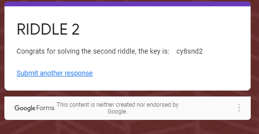

 # Scenario 3:

    * Decode a messege using OpenSSL
    * Decoded Messege: Takagi
    * Answer Key: ud6s98n

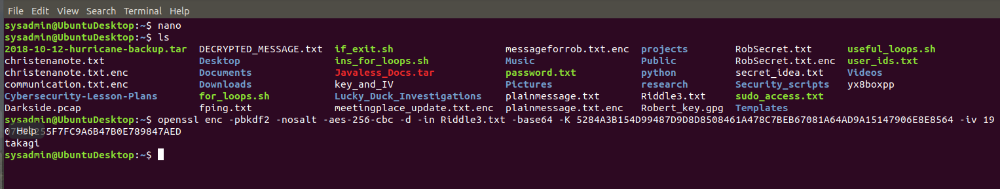

# Scenario 4:

    * Scenario 4 had several general cryptography questions pertaining to Asymmetric questions
    * Succesfully answered all the questions to get the Answer Key
    * Answer Key: 7gsn3nd2

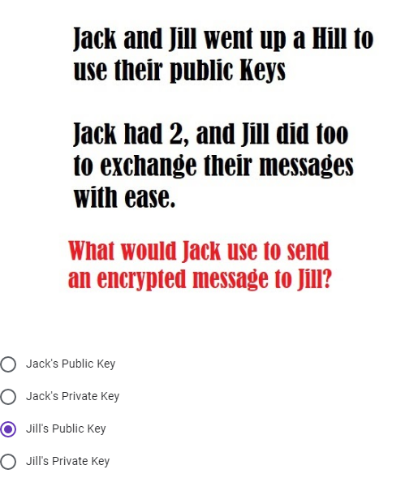
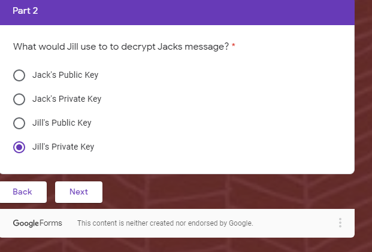
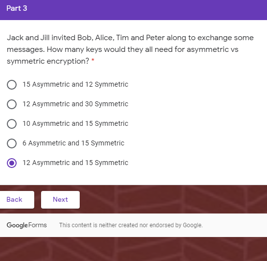

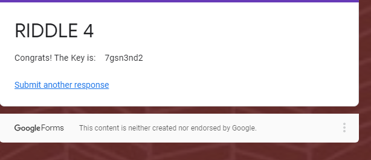

# Scenario 5:

    * Decode a messege using Hash
    * Decode Messege: Argyle
    * Answer Key: ajy39d2

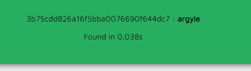 
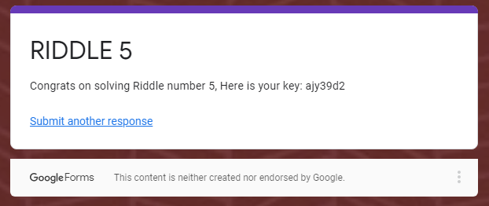

# Scenario 6:

    * Decode a message using Steganography
    * Down Load Image to find the hidden message
    * Also used the riddle inorder to find a password
    * Decoded Messege: mcclane
    * Answe Key: 7skahd6

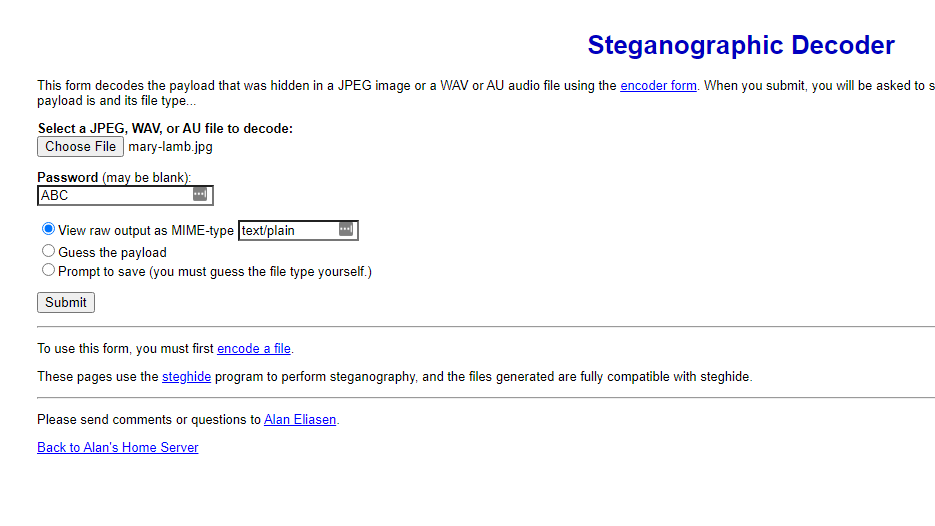 
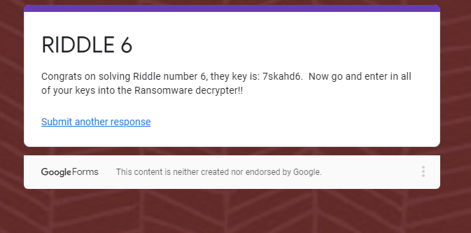

# THE END: Succesfully solved all 6 questions and saved the network from the bag guys

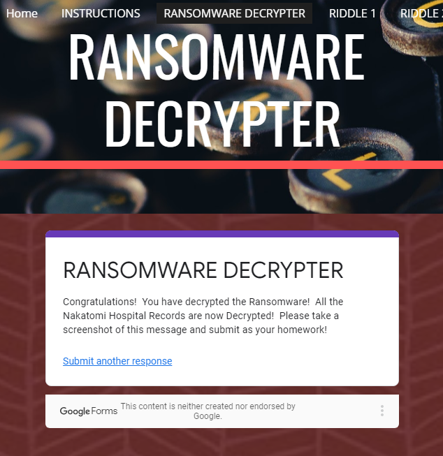

