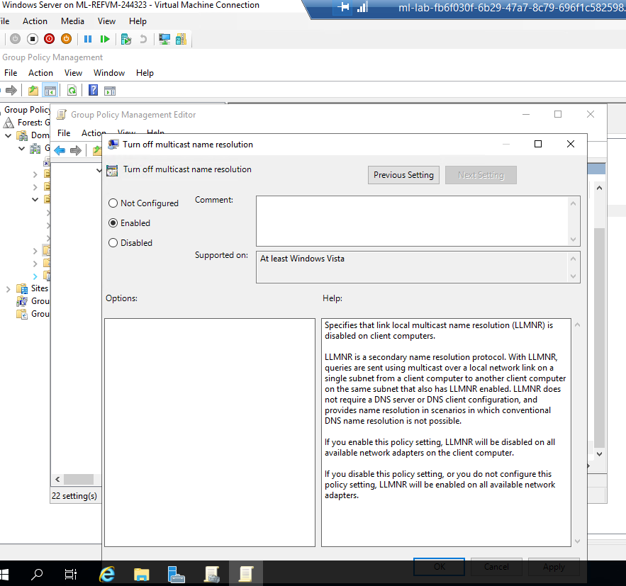
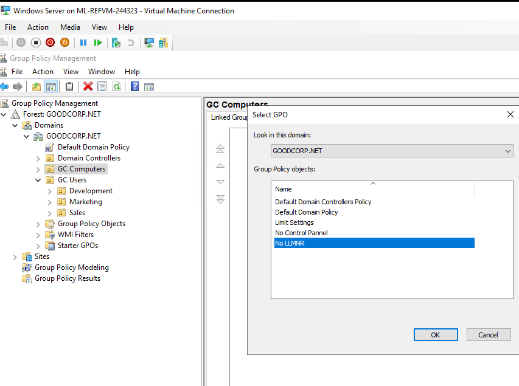
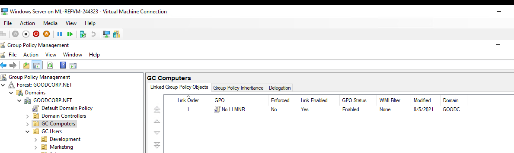
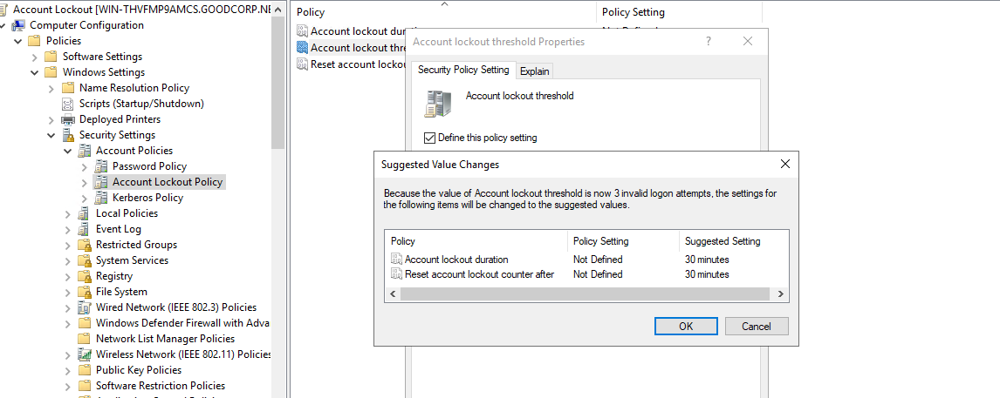
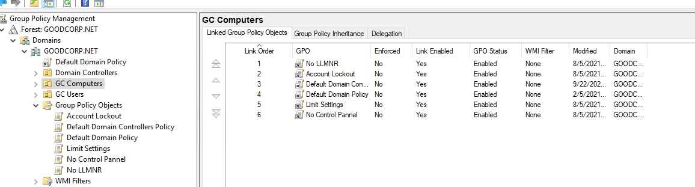

# Rob Myers WEEK 7 Home work

## Task 1: Create a GPO: Disable Local Link Multicast Name Resolution (LLMNR)
    Instructions

    Name the Group Policy Object No LLMNR.

    In the Group Policy Management Editor, the policy you are looking for is at the following path: Computer Configuration\Policies\Administrative Templates\Network\DNS Client.

    Find the policy called Turn Off Multicast Name Resolution.

    Enable this policy.

 

"Picture of  LLMNR enabled" 

  

 

  

    Exit the Group Policy Management Editor and link the GPO to the GC Computers organizational unit you previously created.

 

## Task 2: Create a GPO: Account Lockout

    Create what you believe to be a reasonable account lockout Group Policy for the Windows 10 machine.

    Name the Group Policy Object Account Lockout.

    When editing policies for this new GPO, keep in mind that you're looking for computer configuration policies to apply to your GC Computers OU. Also, these policies involve Windows security settings and accounts.

    Don't forget to link the GPO to your GC Computers organizational unit.

 
"Creating a reasonable account lockout Group Policy"

 
"Linking the Account Lockout GPO to the GC Computers 

