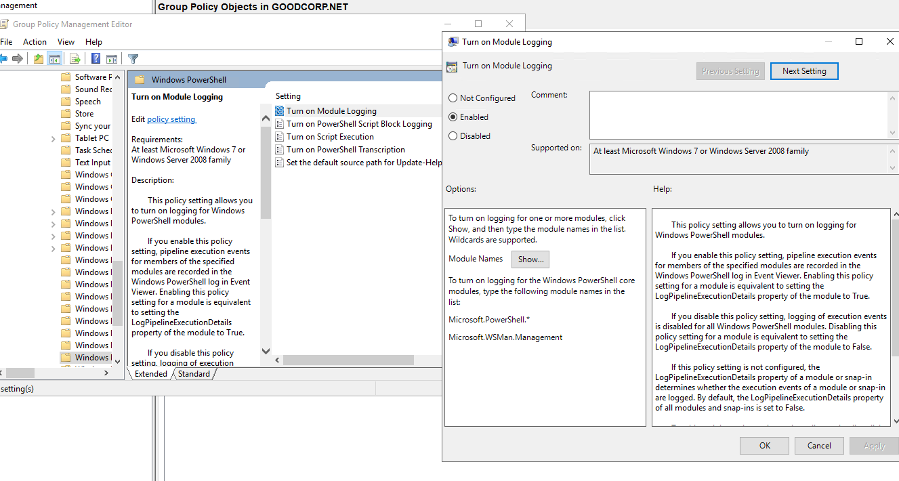
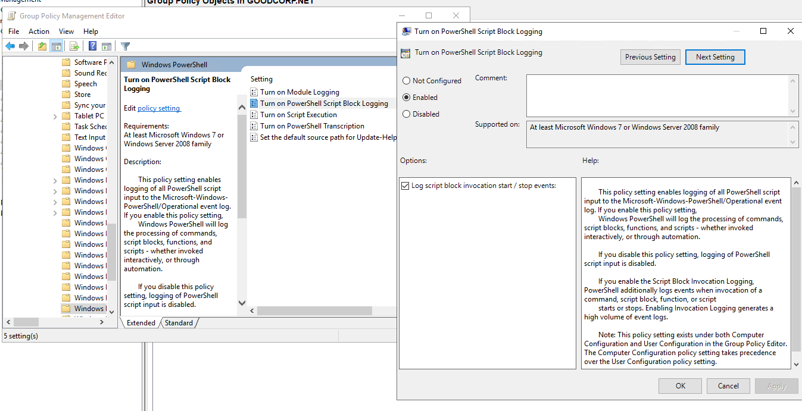
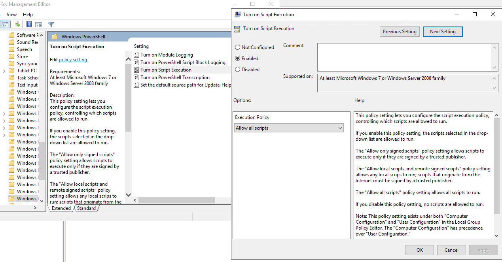
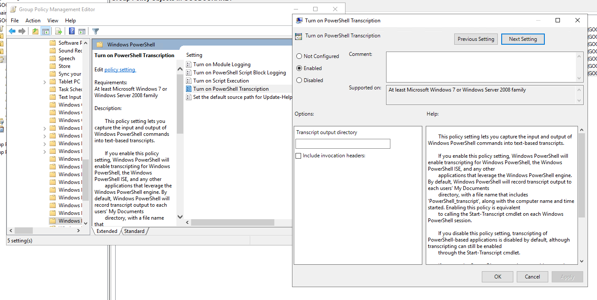
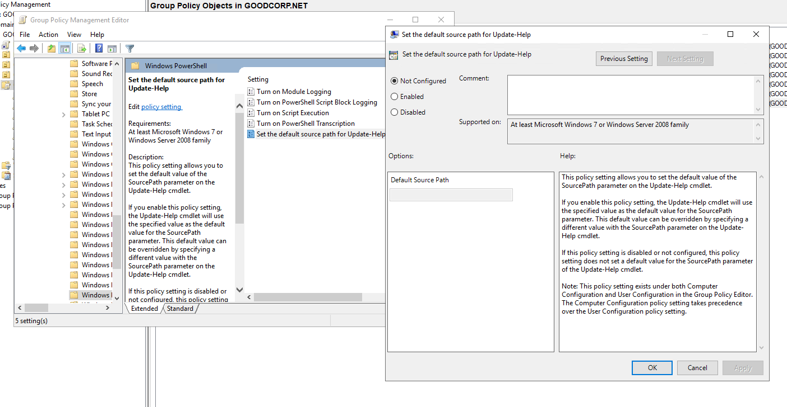
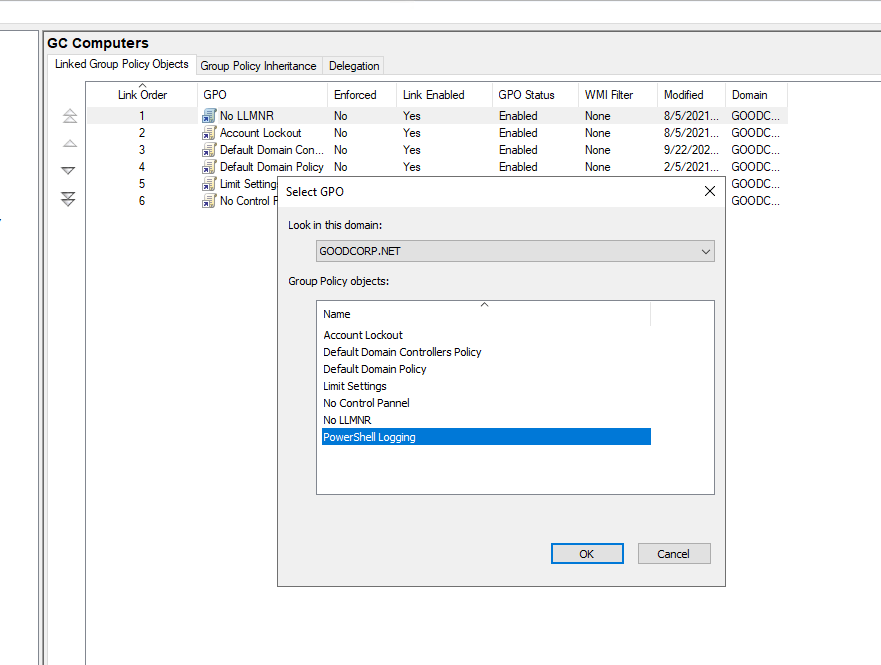
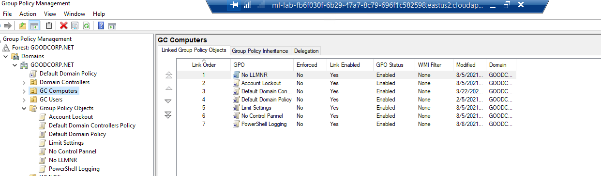

# Rob Myers WEEK 7 Home work

# Task 1: Create a GPO: Disable Local Link Multicast Name Resolution (LLMNR)
    Instructions

    Name the Group Policy Object No LLMNR.

    In the Group Policy Management Editor, the policy you are looking for is at the following path: Computer Configuration\Policies\Administrative Templates\Network\DNS Client.

    Find the policy called Turn Off Multicast Name Resolution.

    Enable this policy.

 

### "Picture of  LLMNR enabled" 

  

### "Picture linking the GPO to the GC Computers

 

  

    Exit the Group Policy Management Editor and link the GPO to the GC Computers organizational unit you previously created.

 

### "GPO is linked"

# Task 2: Create a GPO: Account Lockout

    Create what you believe to be a reasonable account lockout Group Policy for the Windows 10 machine.

    Name the Group Policy Object Account Lockout.

    When editing policies for this new GPO, keep in mind that you're looking for computer configuration policies to apply to your GC Computers OU. Also, these policies involve Windows security settings and accounts.

    Don't forget to link the GPO to your GC Computers organizational unit.
 

### "Creating a reasonable account lockout Group Policy"

 

### "Linking the Account Lockout GPO to the GC Computers 
 

# Task 3: Create a GPO: Enabling Verbose PowerShell Logging and Transcription

Create a Group Policy Object to enable PowerShell logging and transcription. This GPO will combine multiple policies into one, although they are all under the same policy collection.

1. Name the Group Policy Object PowerShell Logging.

2. Enable the Turn on Module Logging and do the following:

    Click Show next to Module Names.

3. Enable the Turn on PowerShell Script Block Logging policy

4. Enable the Turn on Script Execution policy and do the following:

    Set Execution Policy to Allow all scripts.

5. Enable the Turn on PowerShell Transcription policy and do the following:

    Leave the Transcript output directory blank (this defaults to the user's ~\Documents directory).

6. Leave the Set the default source path for Update-Help policy as Not configured.

7. Link this new PowerShell Logging GPO to the GC Computers OU.

s

Picture of the GPO linked with all the other GPO's
