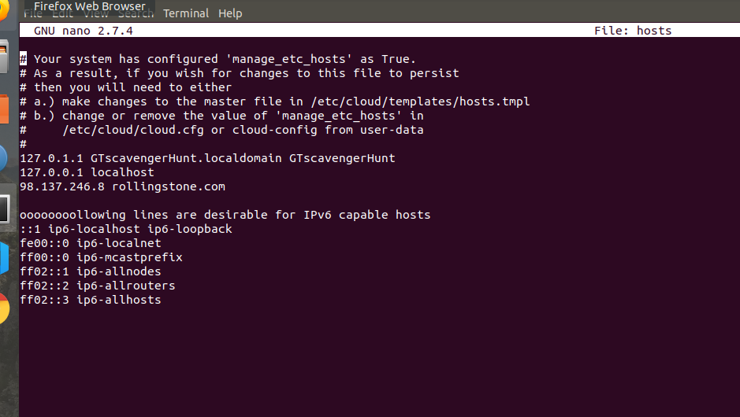

# Rob Myers Week 8 Homework
## Networking Fundamentals Homework: Rocking your Network!

# Phase 1: "I'd like to Teach the World to Ping"

INSTRUCTIONS: 

        * You have been provided a list of network assets belonging to RockStar Corp. Use fping to ping the network assets for only the Hollywood office.

        * Determine the IPs for the Hollywood office and run fping against the IP ranges in order to determine which IP is accepting connections.

        * RockStar Corp doesn't want any of their servers, even if they are up, indicating that they are accepting connections.

        * Create a summary file in a word document that lists out the fping command used, as well as a summary of the results.

        * Your summary should determine which IPs are accepting connections and which are not.

        * Also indicate at which OSI layer your findings are found.

SOLUTIONS: 

   ## Created fping.txt in nano containing all the IP Addresses

  

## From command line ran: fping < fping.txt to show what IP Address is "Alive" and what IP address is "unreachale"

   ## Last, the OSI layer  corresponding with the IP Address is the Network Layer

# Phase 2:  "Some Syn for Nothin`"

INSTRUCTIONS:

    * For the purpose of this exercise, document which ports are open on the RockStar Corp server, and which OSI layer SYN scans run on.

## Example of running the nmap command to locate the open port 22/tcp ssh

## Also the OSI layer SYN scans run on is Transport Layer (Layer 4)

# Phase 3: "I Feel a DNS Change Comin' On"

   * Try to figure out which port/service would be used for remote system administration, and then using these credentials, attempt to log into the IP that responded to pings from Phase 1.

## Logged in as Jimi Hendrix using IP 167.172.144.11

   * While logged into the RockStar server from the previous step, determine if something was modified on this system that might affect viewing rollingstone.com within the browser. When you successfully find the configuration file, record the entry that is set to rollingstone.com.

## Used Nanohosts to find 98.137.246.8 rollingstone.com

   * Terminate your ssh session to the rollingstone server, and use nslookup to determine the real domain of the IP address you found from the previous step.

## Used nslookup 98.137.246.8 to find the right domain

 
## We used HTTP and DNS and that per the OSI layer is the Application Layer (layer 7) 