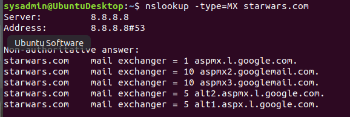
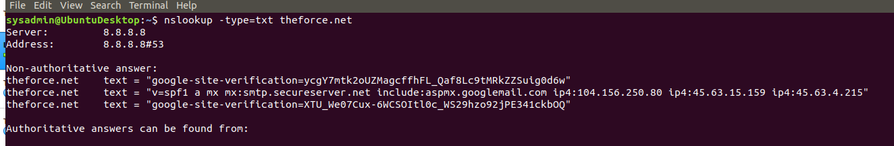
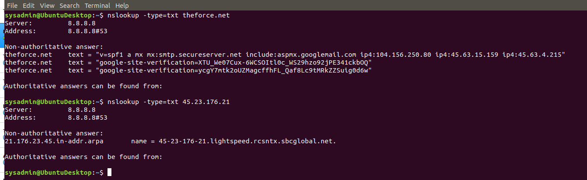
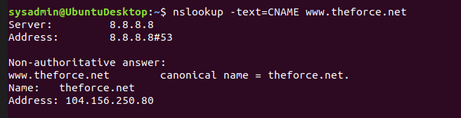
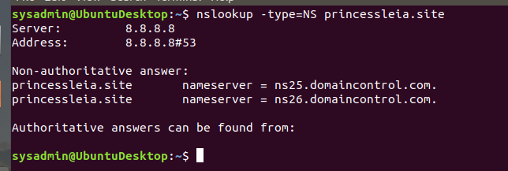
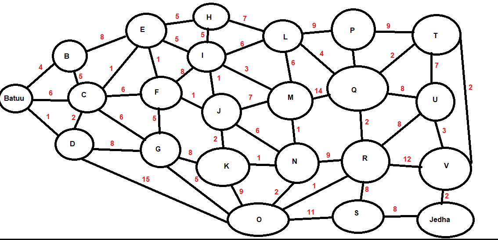
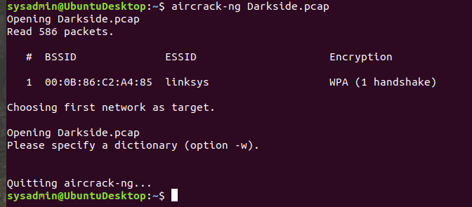
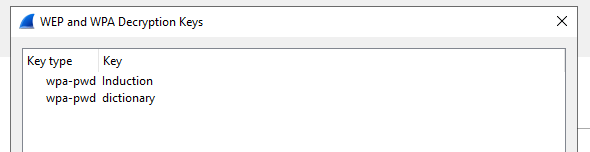
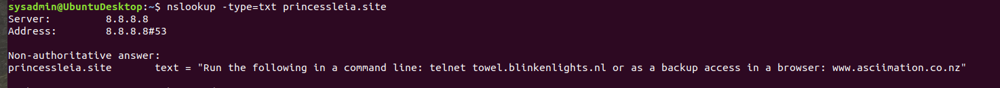
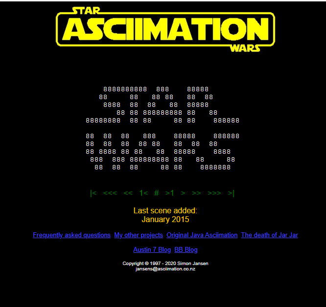

# Rob Myers: Week 9 Homework
 
## Networks Fundamentals II: In a Network Far, Far Away!

Topics Covered in Your Assignments

1)  DNS  
2)  NSLOOKUP  
3)  DNS record types:   
        - A, PTR, MX, NS, SOA, SRV, TXT
4)  Wireless   
        - WEP, WPA
5)  Aircrack-ng  
6)  Wireshark Wireless analysis and decryption

# Mission 1: 

### Determine and document the mail servers for www.starwars.com using NSLOOKUP.

    * Used DNS Record: MX
    * OSI Layer: MP Protocol = Layer 7 - Application Layer
    * nslookup -type=MX starwars.com
    * mail servers listed in picture below

 

## Explain why the Resistance isn't receiving any emails.

    * The resistance needs to update the DNS MX Record so the primary and secondary servers are documented corectly

    * currently the primary and secondary servers are not listed in the MX Record for starwars.com

## Document what a corrected DNS record should be.

 The following should be added to the DNS MX record:

    * starwars.com mail exchanger = 1 asltx.l.google.com
    * starwars.com mail exchanger = 5 asltx.2.google.com

# Mission 2

### Determine and document the SPF for theforce.net using NSLOOKUP.
    * Used DNS record: TXT
    * OSI Layer: TXT Protocol = Layer 4 - Transport Layer
    * OSI Layer: SPF Protocol = Layer 3 - Network Layer
    * nslookup -type=TXT starwars.com
    * Sender Policy Framework listed in picture below

 

### Explain why the Force's emails are going to spam.

    * The Resistance changed their IP Address FROM 104.156.250.80 TO 45.23.176.21

    * The resistance needs to update the TXT Record so that  ip4:45.23.176.21 is included in the text = "v=spf1 a mx mx:smtp.secureserver.net include:
    aspmx.googlemail.com ip4:104.156.250.80 ip4:45.63.15.159 ip4:45.63.4.215" 

### Document what a corrected DNS record should be.

    * ADD the following to the below text: 
    ip4:45-23-176-21.lightspeed.rcsntx.sbcglobal.net

    * text = "v=spf1 a mx mx:smtp.secureserver.net include:
    aspmx.googlemail.com ip4:104.156.250.80 ip4:45.63.15.159 ip4:45.63.4.215 ip4:45-23-176-21.lightspeed.rcsntx.sbcglobal.net" 

# Mission 3

### Document how a CNAME should look by viewing the CNAME of www.theforce.net using NSLOOKUP.

    * Used DNS record: TXT
    * OSI Layer: Layer 4 - Transport Layer
    * nslookup -type=CNAME www.theforce.net

### Explain why the sub page of resistance.theforce.net isn't redirecting to theforce.net.

    * the CNAME Report needs to be updated to include the alias: resistance.theforce.net

### Document what a corrected DNS record should be.

Here is what an updated DNS CNAME Reprot should look like:

    * sysadmin@UbuntuDesktop:~$ nslookup -text=CNAME www.theforce.net
    * Server:		8.8.8.8
    * Address:	8.8.8.8#53

    * Non-authoritative answer:
    * www.theforce.net	canonical name = theforce.net.
    * Name:	theforce.net
    * Address: 104.156.250.80

    * Non-authoritative answer:
    * resistance.theforce.net	canonical name = theforce.net.
    * Name:	theforce.net
    * Address: 104.156.250.80

# Mission 4

### Confirm the DNS records for princessleia.site.

    * Used DNS record: NS
    * OSI Layer: NS Protocol = Layer 3 - Network Layer
    * nslookup -type=NS princessleia.site
    * Name Server record listed in picture below

### Document how you would fix the DNS record to prevent this issue from happening again.

    * Without properly configured NS records, users will be unable to load a website or application

    * The Resistance needs to update the NS records and add the following DNS Server: ns2.galaxybackup.com

# Mission 5

### View the Galaxy Network Map and determine the OSPF shortest path from Batuu to Jedha. 

    * OSPF = Open Shortest Path First
    * OSI Layer: IP Protocol = Layer 3 - Network Layer
    * Picture of the Galaxcy Network Map below

The OSPF shortest path from Planet Batuu to Planet Jedha:  
    * D C E F J I L Q T V JEDHA   
    * 1 2 1 1 1 1 6 4 2 2  2 = 23 Total Hops

### Confirm your path does not include Planet N in its route.

    * The OSPF Planet path does not include Planet N
    * OSPF Planet path: BATUU D C E F J I L Q T V JEDHA

### Document the shortest path so it can be used by the Resistance to develop a static route to improve the traffic.

    * Planet Batuu   >   Planet D   >   Planet C   >   Planet E   >   Planet F   >   Planet J   >   Planet I   >   Planet L   >   Planet Q   >   Planet T   >   Planet V   >   Planet Jedha

# Mission 6
    * Used Aircrack-ng and Wireshark
    * OSI Layer: Layer 5 - Session Layer
    * aircrack-ng Darkside.pcap
    
### Figure out the Dark Side's secret wireless key by using Aircrack-ng.
    * aircrack-ng Darkside.pcap
    * using the aircrack-ng command the Dark Side's secret wireless key is the following: dictionary
    * picture of command below

  
### Use the Dark Side's key to decrypt the wireless traffic in Wireshark.

    * see picture below that the secret wireless key "dictionary" was correct

### Once you have decrypted the traffic, figure out the following Dark Side information:

Host IP Addresses and MAC Addresses by looking at the decrypted ARP traffic.

    * Host IP Address: 172.16.0.101  
    * Host MAC Address: 00:13:ce:55:ef

Document these IP and MAC Addresses, as the resistance will use these IP addresses to launch a retaliatory attack.

    * ?????????????????????????????????????????????

# Mission 7
### As a thank you for saving the galaxy, the Resistance wants to send you a secret message!

    * nslookup -type=txt princessleia.site
    * see picture below of results

    * www.asciimation.co.nz
    * Star Wars A New Hope
    * see picture below

