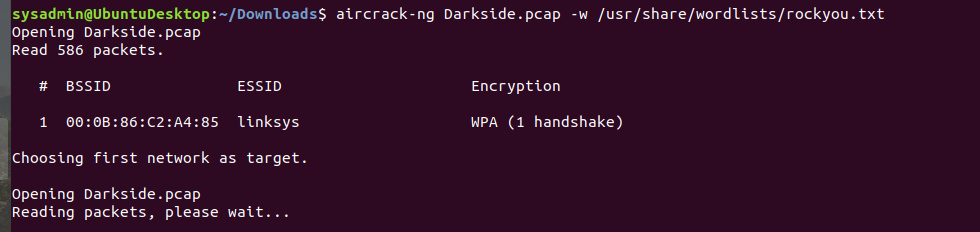
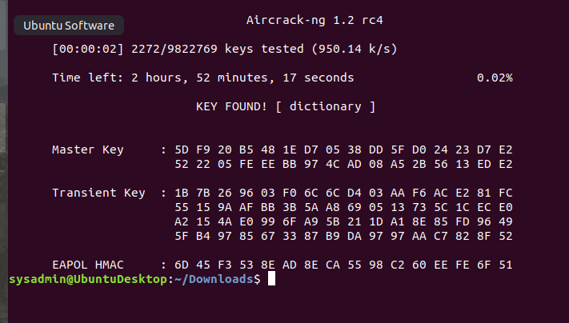
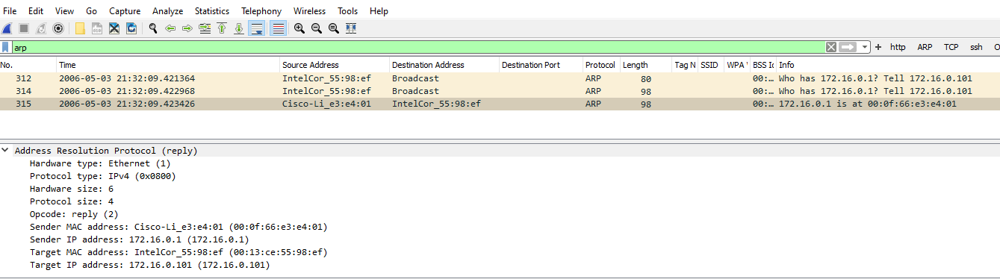
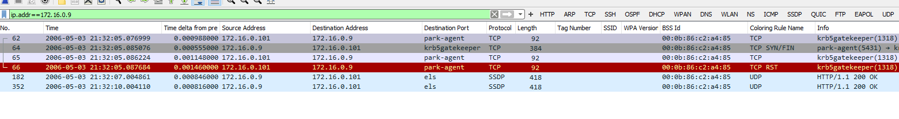
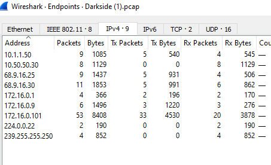
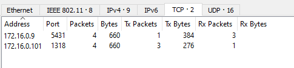

# Rob Myers: Week 9 Homework
 
## Networks Fundamentals II: In a Network Far, Far Away!

Topics Covered in Your Assignments

1)  DNS  
2)  NSLOOKUP  
3)  DNS record types:   
        - A, PTR, MX, NS, SOA, SRV, TXT
4)  Wireless   
        - WEP, WPA
5)  Aircrack-ng  
6)  Wireshark Wireless analysis and decryption

# Mission 1: 

### Determine and document the mail servers for www.starwars.com using NSLOOKUP.

    * Used DNS Record: MX
    * OSI Layer: MP Protocol = Layer 7 - Application Layer
    * nslookup -type=MX starwars.com
    * mail servers listed in picture below

 

## Explain why the Resistance isn't receiving any emails.

    * The resistance needs to update the DNS MX Record so the primary and secondary servers are documented corectly
    * currently the primary and secondary servers are not listed in the MX Record for starwars.com

## Document what a corrected DNS record should be.

 The following should be added to the DNS MX record:

    * starwars.com mail exchanger = 1 asltx.l.google.com
    * starwars.com mail exchanger = 5 asltx.2.google.com

# Mission 2

### Determine and document the SPF for theforce.net using NSLOOKUP.
    * Used DNS record: TXT
    * OSI Layer: TXT Protocol = Layer 4 - Transport Layer
    * OSI Layer: SPF Protocol = Layer 3 - Network Layer
    * nslookup -type=TXT starwars.com
    * Sender Policy Framework listed in picture below

 

### Explain why the Force's emails are going to spam.

    * The Resistance changed their IP Address FROM 104.156.250.80 TO 45.23.176.21
    * The resistance needs to update the TXT Record so that  ip4:45.23.176.21 is included in the text = "v=spf1 a mx mx:smtp.secureserver.net include:
    aspmx.googlemail.com ip4:104.156.250.80 ip4:45.63.15.159 ip4:45.63.4.215" 

### Document what a corrected DNS record should be.

    * ADD the following to the below text: 
    ip4:45-23-176-21.lightspeed.rcsntx.sbcglobal.net
    * text = "v=spf1 a mx mx:smtp.secureserver.net include:
    aspmx.googlemail.com ip4:104.156.250.80 ip4:45.63.15.159 ip4:45.63.4.215 ip4:45-23-176-21.lightspeed.rcsntx.sbcglobal.net" 

# Mission 3

### Document how a CNAME should look by viewing the CNAME of www.theforce.net using NSLOOKUP.

    * Used DNS record: TXT
    * OSI Layer: Layer 4 - Transport Layer
    * nslookup -type=CNAME www.theforce.net

### Explain why the sub page of resistance.theforce.net isn't redirecting to theforce.net.

    * the CNAME Report needs to be updated to include the alias: resistance.theforce.net

### Document what a corrected DNS record should be.

Here is what an updated DNS CNAME Reprot should look like:

    * sysadmin@UbuntuDesktop:~$ nslookup -text=CNAME www.theforce.net
    * Server:		8.8.8.8
    * Address:	8.8.8.8#53

    * Non-authoritative answer:
    * www.theforce.net	canonical name = theforce.net.
    * Name:	theforce.net
    * Address: 104.156.250.80

    * Non-authoritative answer:
    * resistance.theforce.net	canonical name = theforce.net.
    * Name:	theforce.net
    * Address: 104.156.250.80

# Mission 4

### Confirm the DNS records for princessleia.site.

    * Used DNS record: NS
    * OSI Layer: NS Protocol = Layer 3 - Network Layer
    * nslookup -type=NS princessleia.site
    * Name Server record listed in picture below

### Document how you would fix the DNS record to prevent this issue from happening again.

    * Without properly configured NS records, users will be unable to load a website or application
    * The Resistance needs to update the NS records and add the following DNS Server: ns2.galaxybackup.com

# Mission 5

### View the Galaxy Network Map and determine the OSPF shortest path from Batuu to Jedha. 

    * OSPF = Open Shortest Path First
    * OSI Layer: IP Protocol = Layer 3 - Network Layer
    * Picture of the Galaxcy Network Map below

The OSPF shortest path from Planet Batuu to Planet Jedha:  
    * D C E F J I L Q T V JEDHA   
    * 1 2 1 1 1 1 6 4 2 2  2 = 23 Total Hops

### Confirm your path does not include Planet N in its route.

    * The OSPF Planet path does not include Planet N
    * OSPF Planet path: BATUU D C E F J I L Q T V JEDHA

### Document the shortest path so it can be used by the Resistance to develop a static route to improve the traffic.

    * Planet Batuu   >   Planet D   >   Planet C   >   Planet E   >   Planet F   >   Planet J   >   Planet I   >   Planet L   >   Planet Q   >   Planet T   >   Planet V   >   Planet Jedha

# Mission 6
    * Used Aircrack-ng and Wireshark
    * Used sudo locate to find rockyou.txt
    * aircrack-ng Darkside.pcap -w /usr/share/wordlists/rockyou.txt 
    * OSI Layer: Layer 5 - Session Layer
        
### Figure out the Dark Side's secret wireless key by using Aircrack-ng.
    * aircrack-ng Darkside.pcap -w /usr/share/wordlists/rockyou.txt
    * using the aircrack-ng command the Dark Side's secret wireless key is the following: KEYFOUND! [ dictionary ]
    * picture of command below

  
### Use the Dark Side's key to decrypt the wireless traffic in Wireshark.

From Wireshark: Edit/Preferences/Protocols/Ieee 802.11/ Decryption Keys Edit/ wpa-pwd/ dictionary

    * see picture below that the secret wireless key "dictionary" was correct

### Once you have decrypted the traffic, figure out the following Dark Side information:

Host IP Addresses and MAC Addresses by looking at the decrypted ARP traffic.

    * ARP Protocol:
    * Host IP/MAC Address: 172.16.0.101 / 00:13:ce:55:98:ef 
    * Host IP/MAC Address: 172.16.0.1 / 00:0f:66:e3:e4:01 

Document these IP and MAC Addresses, as the resistance will use these IP addresses to launch a retaliatory attack.

The resistance will use the following to attack the Empire:   
    
    * IP: 172.16.0.101    MAC: 00:13:ce:55:98:ef     
    * IP: 172.16.0.1      MAC: 00:0f:66:e3:e4:01  

IP and MAC Address's of interest:

    * IP: 172.16.09   MAC: 00:14:bf:of:03:30 (TCP Protocol)    
    * IP: 10.50.50.30 MAC: 00:13:ce:55:98:ef   

Duplicate IP and MAC Address:

    * the following have the same MAC Address (MAC: 00:0f:66:e3:e4:01) associated with differentIP Addresses 
    * IP: 10.1.1.50    MAC: 00:0f:66:e3:e4:01 
    * IP: 68.9.16.25   MAC: 00:0f:66:e3:e4:01
    * IP: 68.9.16.30   MAC: 00:0f:66:e3:e4:01

Remaining IP and MAC addresses in the Darkside PCAP File:

    * 224.0.0.22  /  01:00;5e:00:00:16
    * 239.255.255.250   /   01:00:5e:7f:ff:gfa
    * BSS ID: 00:0b:86:c2:c4:85
    * wlad: 00:14:bf:of:03:32

## Warning: 
 IP: 172.16.09 Mac: 00:14:bf:of:03:30 PORT: 5431 be open to TCP reset attack
<brk>

### * NOTE: I went through all IP and MAC address listed in Endpoints to also include the IEEE 802.11.8 Address's as well looking for duplicate MAC Address associated with one IP Address and ways to navigate and explore Wireshark

 

 

# Mission 7
### As a thank you for saving the galaxy, the Resistance wants to send you a secret message!

    * nslookup -type=txt princessleia.site
    * see picture below of results

    * www.asciimation.co.nz
    * Star Wars A New Hope
    * see picture below

